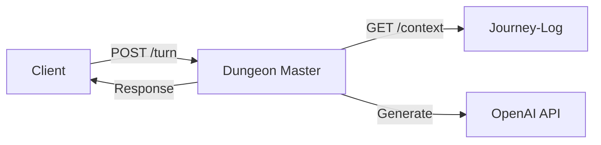

# Dungeon Master Service

AI-powered narrative generation service for dungeon crawling adventures. The Dungeon Master service orchestrates context retrieval from the journey-log service and uses LLM-based generation to create dynamic story responses.

## Overview

This service provides a FastAPI backend that:
- Accepts player turn actions via POST /turn endpoint
- Fetches character context from the journey-log service
- Generates AI narrative responses using OpenAI GPT models
- Provides health check endpoint with optional journey-log connectivity verification

## Quick Start

### Prerequisites

- Python 3.14+ (see `python_dev_versions.txt`)
- Access to a running journey-log service
- OpenAI API key

### Installation

1. Clone the repository:
```bash
git clone https://github.com/AgentFoundryExamples/dungeon-master.git
cd dungeon-master
```

2. Create and activate a virtual environment:
```bash
python -m venv venv
source venv/bin/activate  # On Windows: venv\Scripts\activate
```

3. Install dependencies:
```bash
pip install -r requirements.txt
```

4. Configure environment variables:
```bash
cp .env.example .env
# Edit .env and set required values (see Configuration section below)
```

### Running the Service

Start the development server:
```bash
python -m app.main
```

Or using uvicorn directly:
```bash
uvicorn app.main:app --host 0.0.0.0 --port 8080 --reload
```

The service will be available at:
- API: http://localhost:8080
- Interactive docs (Swagger): http://localhost:8080/docs
- Alternative docs (ReDoc): http://localhost:8080/redoc
- OpenAPI schema: http://localhost:8080/openapi.json

## Configuration

All configuration is managed through environment variables. Copy `.env.example` to `.env` and configure:

### Required Configuration

| Variable | Description | Example |
|----------|-------------|---------|
| `JOURNEY_LOG_BASE_URL` | Base URL for journey-log service | `http://localhost:8000` |
| `OPENAI_API_KEY` | OpenAI API key for LLM requests | `sk-...` |

### Optional Configuration

| Variable | Default | Description |
|----------|---------|-------------|
| `JOURNEY_LOG_TIMEOUT` | `30` | HTTP timeout for journey-log (1-300 seconds) |
| `OPENAI_MODEL` | `gpt-4` | OpenAI model for narrative generation |
| `OPENAI_TIMEOUT` | `60` | HTTP timeout for OpenAI (1-600 seconds) |
| `HEALTH_CHECK_JOURNEY_LOG` | `false` | Enable journey-log ping in health checks |
| `SERVICE_NAME` | `dungeon-master` | Service name for logging |
| `LOG_LEVEL` | `INFO` | Logging level (DEBUG/INFO/WARNING/ERROR/CRITICAL) |

### Configuration Validation

The service validates all configuration at startup and will fail fast with actionable error messages if:
- Required variables are missing
- URLs are malformed
- Numeric values are out of range
- Invalid enum values are provided

## API Documentation

### POST /turn

Process a player turn and generate narrative response.

**Request:**
```json
{
  "character_id": "550e8400-e29b-41d4-a716-446655440000",
  "user_action": "I search the room for treasure",
  "trace_id": "optional-trace-id"
}
```

**Response:**
```json
{
  "narrative": "You search the dimly lit room and discover a glinting treasure chest..."
}
```

**Status Codes:**
- `200`: Success
- `400`: Invalid request (malformed UUID, validation error)
- `404`: Character not found
- `500`: Internal server error

### GET /health

Check service health status with optional journey-log connectivity verification.

**Response (healthy):**
```json
{
  "status": "healthy",
  "service": "dungeon-master",
  "journey_log_accessible": true
}
```

**Response (degraded):**
```json
{
  "status": "degraded",
  "service": "dungeon-master",
  "journey_log_accessible": false
}
```

**Status Codes:**
- `200`: Service is operational (healthy or degraded)

Note: The health endpoint returns 200 even when degraded to avoid restart loops. Use the `status` field to determine actual health.

## Development

### Code Quality

Format code with ruff:
```bash
ruff format .
ruff check . --fix
```

Type check with mypy:
```bash
mypy app/
```

### Testing

Run tests with pytest:
```bash
pytest
```

Run with coverage:
```bash
pytest --cov=app tests/
```

## Deployment

### Docker

A Dockerfile following GCP Cloud Run best practices:

```dockerfile
FROM python:3.14-slim

WORKDIR /app

# Copy requirements and install dependencies
COPY requirements.txt .
RUN pip install --no-cache-dir -r requirements.txt

# Copy application code
COPY app/ ./app/

# Set environment for production
ENV LOG_LEVEL=INFO

# Run on port 8080 (Cloud Run default)
CMD ["uvicorn", "app.main:app", "--host", "0.0.0.0", "--port", "8080"]
```

### Google Cloud Run

Deploy to Cloud Run:

```bash
# Build and push to Artifact Registry
gcloud builds submit --tag us-central1-docker.pkg.dev/PROJECT_ID/dungeon-master/app:latest

# Deploy to Cloud Run
gcloud run deploy dungeon-master \
  --image us-central1-docker.pkg.dev/PROJECT_ID/dungeon-master/app:latest \
  --region us-central1 \
  --platform managed \
  --set-env-vars JOURNEY_LOG_BASE_URL=https://journey-log-xyz.run.app \
  --set-secrets OPENAI_API_KEY=openai-key:latest \
  --allow-unauthenticated
```

See `gcp_deployment_reference.md` for detailed deployment instructions.

## Architecture



### Components

- **app/main.py**: FastAPI application entry point and lifespan management
- **app/api/routes.py**: Route handlers for /turn and /health endpoints
- **app/models.py**: Pydantic models for request/response validation
- **app/config.py**: Configuration loading and validation
- **.env.example**: Configuration template with documentation

### Data Models

**TurnRequest**: Player turn input
- `character_id` (str): UUID of the character
- `user_action` (str): Player's action (1-8000 chars)
- `trace_id` (Optional[str]): Request correlation ID

**TurnResponse**: AI-generated narrative
- `narrative` (str): Generated story response

**JourneyLogContext**: Character state from journey-log
- `character_id`, `status`, `location`
- `active_quest`, `combat_state`
- `recent_history` (list of narrative turns)

## Troubleshooting

### Configuration Errors

**Error:** `journey_log_base_url must start with http:// or https://`
**Solution:** Ensure JOURNEY_LOG_BASE_URL includes the protocol scheme.

**Error:** `openai_api_key cannot be empty`
**Solution:** Set OPENAI_API_KEY in your .env file or environment.

### Connection Issues

**Symptom:** Health check shows degraded status
**Solution:** Verify journey-log service is running and accessible at configured URL.

**Symptom:** OpenAI API timeout
**Solution:** Increase OPENAI_TIMEOUT value or check network connectivity.

## Current Status

**Note:** This is the initial scaffold implementation. The following features are stubbed:
- Full journey-log context orchestration (returns placeholder in POST /turn)
- OpenAI LLM integration (returns stub response)
- Error handling for external service failures

These will be implemented in subsequent issues.


# Permanents (License, Contributing, Author)

Do not change any of the below sections

## License

This Agent Foundry Project is licensed under the Apache 2.0 License - see the LICENSE file for details.

## Contributing

Feel free to submit issues and enhancement requests!

## Author

Created by Agent Foundry and John Brosnihan
