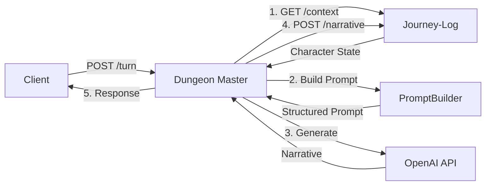

# Dungeon Master Service

AI-powered narrative generation service for dungeon crawling adventures. The Dungeon Master service orchestrates context retrieval from the journey-log service and uses LLM-based generation to create dynamic story responses.

## Overview

This service provides a FastAPI backend that:
- Accepts player turn actions via POST /turn endpoint
- Fetches character context from the journey-log service
- Generates AI narrative responses using OpenAI GPT models
- Provides health check endpoint with optional journey-log connectivity verification

## Quick Start

### Prerequisites

- Python 3.14+ (see `python_dev_versions.txt`)
- Access to a running journey-log service
- OpenAI API key

### Installation

1. Clone the repository:
```bash
git clone https://github.com/AgentFoundryExamples/dungeon-master.git
cd dungeon-master
```

2. Create and activate a virtual environment:
```bash
python -m venv venv
source venv/bin/activate  # On Windows: venv\Scripts\activate
```

3. Install dependencies:
```bash
pip install -r requirements.txt
```

4. Configure environment variables:
```bash
cp .env.example .env
# Edit .env and set required values (see Configuration section below)
```

### Running the Service

Start the development server:
```bash
python -m app.main
```

Or using uvicorn directly:
```bash
uvicorn app.main:app --host 0.0.0.0 --port 8080 --reload
```

The service will be available at:
- API: http://localhost:8080
- Interactive docs (Swagger): http://localhost:8080/docs
- Alternative docs (ReDoc): http://localhost:8080/redoc
- OpenAPI schema: http://localhost:8080/openapi.json

## Configuration

All configuration is managed through environment variables. Copy `.env.example` to `.env` and configure:

### Required Configuration

| Variable | Description | Example |
|----------|-------------|---------|
| `JOURNEY_LOG_BASE_URL` | Base URL for journey-log service | `http://localhost:8000` |
| `OPENAI_API_KEY` | OpenAI API key for LLM requests | `sk-...` |

### Optional Configuration

| Variable | Default | Description |
|----------|---------|-------------|
| `JOURNEY_LOG_TIMEOUT` | `30` | HTTP timeout for journey-log (1-300 seconds) |
| `JOURNEY_LOG_RECENT_N` | `20` | Number of recent turns to fetch (1-100) |
| `OPENAI_MODEL` | `gpt-5.1` | OpenAI model for narrative generation |
| `OPENAI_TIMEOUT` | `60` | HTTP timeout for OpenAI (1-600 seconds) |
| `OPENAI_STUB_MODE` | `false` | Enable stub mode for offline development |
| `HEALTH_CHECK_JOURNEY_LOG` | `false` | Enable journey-log ping in health checks |
| `SERVICE_NAME` | `dungeon-master` | Service name for logging |
| `LOG_LEVEL` | `INFO` | Logging level (DEBUG/INFO/WARNING/ERROR/CRITICAL) |
| `LOG_JSON_FORMAT` | `false` | Enable JSON structured logging output |
| `ENABLE_METRICS` | `false` | Enable metrics collection and /metrics endpoint |
| `ENABLE_DEBUG_ENDPOINTS` | `false` | Enable debug endpoints (local development only) |

### PolicyEngine Configuration

The PolicyEngine provides deterministic quest and POI trigger evaluation with configurable parameters and reproducible randomness.

| Variable | Default | Description |
|----------|---------|-------------|
| `QUEST_TRIGGER_PROB` | `0.3` | Quest trigger probability (0.0-1.0) |
| `QUEST_COOLDOWN_TURNS` | `5` | Turns between quest triggers (0 or greater) |
| `POI_TRIGGER_PROB` | `0.2` | POI trigger probability (0.0-1.0) |
| `POI_COOLDOWN_TURNS` | `3` | Turns between POI triggers (0 or greater) |
| `RNG_SEED` | (unset) | Optional RNG seed for deterministic behavior |

## Policy Engine Debugging

The PolicyEngine makes deterministic decisions about when to trigger quests and POIs independently of LLM outputs. This section explains how to debug and test policy behavior.

### Understanding Policy Decisions

Each turn, the PolicyEngine evaluates two independent decisions:
1. **Quest Trigger**: Should a new quest be offered?
2. **POI Trigger**: Should a new point of interest be created?

These decisions are based on:
- **Eligibility**: Cooldown periods and game state (e.g., already has active quest)
- **Probability**: Configurable random roll (e.g., 30% chance)
- **Determinism**: Optional seeded RNG for reproducible testing

Policy decisions are logged but **never exposed** to players in the API response.

### Enabling Debug Logging

To see detailed policy decision logs:

1. Set log level to DEBUG in `.env`:
```bash
LOG_LEVEL=DEBUG
```

2. Run the service and watch logs:
```bash
python -m app.main
```

3. Look for log entries like:
```
Quest trigger evaluation: character_id=..., eligible=True, roll_passed=False, reasons=none
POI trigger evaluation: character_id=..., eligible=True, roll_passed=True, reasons=none
Policy decisions evaluated | quest_eligible=True quest_roll_passed=False poi_eligible=True poi_roll_passed=True
```

### Using Deterministic Seeds

For reproducible testing and debugging, set an RNG seed:

```bash
# In .env
RNG_SEED=42
```

With a seed set:
- Each character gets their own deterministic RNG sequence
- Restarting the service produces identical roll results
- Tests can verify exact policy behavior

**Important**: Don't use seeds in production - they reduce randomness security.

### Policy Profiles

The `.env.example` file includes several pre-configured profiles for common testing scenarios:

#### High Frequency Profile
Test frequent quest and POI triggers:
```bash
QUEST_TRIGGER_PROB=0.9
QUEST_COOLDOWN_TURNS=1
POI_TRIGGER_PROB=0.8
POI_COOLDOWN_TURNS=1
RNG_SEED=42
```

#### Low Frequency Profile
Test rare triggers and long cooldowns:
```bash
QUEST_TRIGGER_PROB=0.1
QUEST_COOLDOWN_TURNS=10
POI_TRIGGER_PROB=0.1
POI_COOLDOWN_TURNS=10
RNG_SEED=42
```

#### Deterministic Testing Profile
Guarantee triggers for testing:
```bash
QUEST_TRIGGER_PROB=1.0
QUEST_COOLDOWN_TURNS=0
POI_TRIGGER_PROB=1.0
POI_COOLDOWN_TURNS=0
RNG_SEED=999
```

#### Disabled Profile
Completely disable triggers:
```bash
QUEST_TRIGGER_PROB=0.0
QUEST_COOLDOWN_TURNS=999
POI_TRIGGER_PROB=0.0
POI_COOLDOWN_TURNS=999
```

### Interpreting Log Output

Policy decision logs include these key fields:

- **eligible**: Whether the trigger meets basic requirements (cooldown, no active quest, etc.)
- **roll_passed**: Whether the random roll succeeded (based on configured probability)
- **reasons**: Why the trigger was ineligible (if applicable)

Example log analysis:
```
# Quest was eligible but roll failed (70% chance to fail with default 0.3 probability)
Quest trigger evaluation: eligible=True, roll_passed=False

# POI was ineligible due to cooldown
POI trigger evaluation: eligible=False, roll_passed=False, reasons=cooldown_not_met (turns=2, required=3)
```

### Testing Policy Decisions

The test suite includes comprehensive policy tests:

```bash
# Run policy engine unit tests
python -m pytest tests/test_policy_engine.py -v

# Run integration tests with policy decisions
python -m pytest tests/test_turn_integration.py -v

# Run prompt builder tests (verifies policy hints)
python -m pytest tests/test_prompt_builder.py -v
```

Key test categories:
- **Eligibility permutations**: Quest present/absent, combat active, cooldown boundaries
- **Seeded randomness**: Deterministic outcomes with seeds
- **Profile overrides**: High/low frequency settings
- **Integration**: Policy hints in prompts, failed rolls blocking writes

### Verifying Policy Independence

To verify that policy decisions are independent of LLM outputs:

1. Set `QUEST_TRIGGER_PROB=0.0` (disable quest triggers)
2. Make a turn request asking for a quest: `"I ask the innkeeper for a quest"`
3. Check logs - quest should be blocked despite LLM potentially suggesting one
4. Verify response doesn't include quest-related updates

The LLM may still generate quest-related narrative, but the quest won't be persisted to journey-log due to the failed policy roll.

## API Endpoints
| `RNG_SEED` | `<unset>` | Optional RNG seed for deterministic debugging |

**Notes:**
- Probabilities outside [0,1] are rejected at config load and PolicyEngine initialization (fail-fast behavior)
- Zero or negative cooldown values are valid and skip waiting periods
- Seeded RNG respects character-specific seeds while allowing global fallback randomness
- When `RNG_SEED` is unset (recommended for production), secure randomness is used
- When `RNG_SEED` is set to an integer, enables reproducible behavior for testing/debugging
- **Memory Management**: Seeded mode caches RNG instances per character. For long-running services with high character turnover, consider using unseeded mode or periodic service restarts

### Configuration Validation

The service validates all configuration at startup and will fail fast with actionable error messages if:
- Required variables are missing
- URLs are malformed
- Numeric values are out of range
- Invalid enum values are provided

## API Documentation

### POST /turn

Process a player turn and generate AI-powered narrative response.

**Orchestration Flow:**
1. Validates the turn request
2. Fetches character context from journey-log service (recent_n=20, include_pois=false)
3. Builds a structured prompt with system instructions and context
4. Calls OpenAI Responses API (gpt-5.1) for narrative generation
5. Persists the user_action and generated narrative to journey-log
6. Returns the narrative and intents to the client

**Request:**
```json
{
  "character_id": "550e8400-e29b-41d4-a716-446655440000",
  "user_action": "I search the room for treasure",
  "trace_id": "optional-trace-id"
}
```

**Response:**
```json
{
  "narrative": "You search the dimly lit room and discover a glinting treasure chest...",
  "intents": {
    "quest_intent": {"action": "none"},
    "combat_intent": {"action": "none"},
    "poi_intent": {
      "action": "create",
      "name": "Hidden Chamber",
      "description": "A secret room filled with treasures"
    },
    "meta": {
      "player_mood": "excited",
      "pacing_hint": "normal"
    }
  }
}
```

**Response Fields:**
- `narrative` (string, required): AI-generated narrative text that is persisted to journey-log
- `intents` (object, optional): Structured intents from LLM output (informational only, not persisted)
  - Present when LLM response is valid
  - Null when LLM response fails validation
  - Contains quest, combat, POI, and meta intents
  - **Important**: Only `narrative` is persisted to journey-log; intents are descriptive and informational

**Status Codes:**
- `200`: Success - narrative generated and persisted
- `400`: Invalid request (malformed UUID, validation error)
- `404`: Character not found in journey-log
- `502`: Journey-log or LLM service error
- `504`: Timeout fetching context or generating narrative

### GET /health

Check service health status with optional journey-log connectivity verification.

**Response (healthy):**
```json
{
  "status": "healthy",
  "service": "dungeon-master",
  "journey_log_accessible": true
}
```

**Response (degraded):**
```json
{
  "status": "degraded",
  "service": "dungeon-master",
  "journey_log_accessible": false
}
```

**Status Codes:**
- `200`: Service is operational (healthy or degraded)

Note: The health endpoint returns 200 even when degraded to avoid restart loops. Use the `status` field to determine actual health.

### GET /metrics

Get service metrics including request counts, error rates, and operation latencies (requires `ENABLE_METRICS=true`).

**Response:**
```json
{
  "uptime_seconds": 3600.0,
  "requests": {
    "total": 150,
    "success": 145,
    "errors": 5,
    "by_status_code": {
      "200": 145,
      "404": 3,
      "502": 2
    }
  },
  "errors": {
    "by_type": {
      "character_not_found": 3,
      "llm_error": 2
    }
  },
  "latencies": {
    "turn": {
      "count": 145,
      "avg_ms": 1250.5,
      "min_ms": 800.2,
      "max_ms": 3200.8
    },
    "llm_call": {
      "count": 145,
      "avg_ms": 950.3,
      "min_ms": 600.1,
      "max_ms": 2500.5
    },
    "journey_log_fetch": {
      "count": 145,
      "avg_ms": 150.2,
      "min_ms": 80.5,
      "max_ms": 450.1
    }
  }
}
```

**Status Codes:**
- `200`: Metrics available
- `404`: Metrics endpoint disabled (set `ENABLE_METRICS=true`)

### POST /debug/parse_llm

**WARNING: Local development only. Do NOT enable in production.**

Test the LLM response parser with raw JSON payloads (requires `ENABLE_DEBUG_ENDPOINTS=true`).

This debug endpoint allows developers to submit raw LLM responses and receive detailed validation results, making it easier to test and debug the outcome parser behavior.

**Request:**
```json
{
  "llm_response": "{\"narrative\": \"You discover a treasure chest.\", \"intents\": {...}}",
  "trace_id": "debug-test-123"
}
```

**Response:**
```json
{
  "is_valid": true,
  "narrative": "You discover a treasure chest.",
  "has_outcome": true,
  "error_type": null,
  "error_details": null,
  "intents_summary": {
    "has_quest_intent": false,
    "has_combat_intent": false,
    "has_poi_intent": true,
    "has_meta_intent": true
  },
  "schema_version": 1
}
```

**Status Codes:**
- `200`: Parse results returned (regardless of validation outcome)
- `400`: Invalid request (missing required fields)
- `404`: Debug endpoints disabled (set `ENABLE_DEBUG_ENDPOINTS=true`)

## Observability

### Structured Logging

The service provides comprehensive structured logging with correlation IDs for request tracking.

#### Log Fields

All logs include:
- `timestamp`: ISO 8601 timestamp
- `level`: Log level (DEBUG, INFO, WARNING, ERROR, CRITICAL)
- `logger`: Logger name (module path)
- `message`: Log message
- `request_id`: Request correlation ID (from X-Trace-Id or X-Request-Id header, or auto-generated UUID)
- `character_id`: Character UUID (when processing a turn)

#### Log Phases

The service logs all major phases of turn processing:
1. **Request Start**: Incoming request with method, path, and client IP
2. **Context Fetch**: Journey-log context retrieval with duration
3. **Prompt Build**: Prompt construction phase
4. **LLM Call**: Narrative generation with model and duration
5. **Narrative Save**: Persistence to journey-log with duration
6. **Request Complete**: Final response with status code and total duration

#### JSON Logging

Enable JSON structured logging for easier parsing by log aggregation tools:
```bash
LOG_JSON_FORMAT=true
```

Example JSON log:
```json
{
  "timestamp": "2025-01-16T10:30:45.123Z",
  "level": "INFO",
  "logger": "app.api.routes",
  "message": "Phase completed: llm_call",
  "request_id": "550e8400-e29b-41d4-a716-446655440000",
  "character_id": "7c9e6679-7425-40de-944b-e07fc1f90ae7",
  "duration_ms": "1250.45"
}
```

#### Secret Redaction

API keys and sensitive data are automatically redacted from logs:
- OpenAI API keys (`sk-***REDACTED***`)
- Bearer tokens
- Generic API key patterns

#### Correlation IDs

Requests can include correlation IDs for distributed tracing:
- **X-Trace-Id header**: Client-provided trace ID (highest priority)
- **X-Request-Id header**: Alternative request ID header
- **Auto-generated**: UUID generated if no header provided

All logs and responses include the request ID for end-to-end tracing.

### Error Handling

The service returns structured error responses for all failure scenarios:

```json
{
  "detail": {
    "error": {
      "type": "character_not_found",
      "message": "Character 550e8400-e29b-41d4-a716-446655440000 not found in journey-log",
      "request_id": "7c9e6679-7425-40de-944b-e07fc1f90ae7"
    }
  }
}
```

#### Error Types

Machine-readable error types for automated handling:
- `character_not_found`: Character doesn't exist (404)
- `journey_log_timeout`: Journey-log service timeout (504)
- `journey_log_error`: Journey-log communication failure (502)
- `llm_timeout`: LLM service timeout (504)
- `llm_response_error`: Invalid LLM response (502)
- `llm_error`: LLM generation failure (502)
- `internal_error`: Unexpected error (500)

### Metrics Collection

Enable optional in-memory metrics collection:
```bash
ENABLE_METRICS=true
```

When enabled, the service tracks:
- **Request Counts**: Total, success, errors by status code
- **Error Counts**: By error type
- **Latencies**: Min, max, average for operations
  - `turn`: Complete turn processing time
  - `llm_call`: LLM narrative generation time
  - `journey_log_fetch`: Context retrieval time
  - `journey_log_persist`: Narrative persistence time

Access metrics via GET /metrics endpoint.

**Note**: Metrics are stored in-memory and reset on service restart. For production monitoring, integrate with Prometheus or other observability platforms.

### LLM Response Parsing and Validation

The service uses a robust parser (`OutcomeParser`) that defensively validates LLM responses against the `DungeonMasterOutcome` schema while ensuring narrative text is always preserved.

#### Parser Behavior

**On Success:**
- Validates JSON structure against `DungeonMasterOutcome` schema
- Returns typed outcome with structured intents
- Logs successful parse with schema version

**On Failure:**
- **JSON Decode Errors**: Uses raw response text as narrative fallback
- **Validation Errors**: Extracts narrative from partial JSON, defaulting intents to None
- **Schema Violations**: Logs detailed errors with schema version, truncated payload (max 500 chars), and validation error list
- **Always Returns Narrative**: Ensures journey-log persistence succeeds even with invalid intents

#### Schema Conformance Metrics

When metrics are enabled (`ENABLE_METRICS=true`), the parser tracks schema conformance rate:

```json
{
  "schema_conformance": {
    "total_parses": 150,
    "successful_parses": 145,
    "failed_parses": 5,
    "conformance_rate": 0.9667
  }
}
```

This helps monitor LLM reliability and identify when prompt engineering adjustments may be needed.

#### Validation Error Logging

Failed validations log detailed diagnostic information:

```
LLM response failed schema validation | schema_version=1 error_type=validation_error 
error_count=1 error_details=["intents.quest_intent.action: literal_error - Input should be 
'none', 'offer', 'complete' or 'abandon'"] payload_preview={"narrative": "...", ...} (truncated)
```

**Logged Information:**
- `schema_version`: Current outcome schema version for tracking evolution
- `error_type`: Classification (json_decode_error, validation_error, unexpected_error)
- `error_details`: Specific field-level validation failures
- `payload_preview`: Truncated response (secrets redacted, max 500 chars)

#### Fallback Narrative Extraction

The parser uses multiple strategies to preserve narrative:

1. **Direct Field Extraction**: Attempts to get `narrative` field from partial JSON
2. **Pattern Matching**: Searches for narrative patterns in malformed JSON
3. **Raw Text Fallback**: Uses entire response text if no structure found
4. **Safe Default**: Returns error message only if text too short or looks like error

**Example Edge Cases:**
- **Invalid Action Literal**: `{"action": "ofer"}` → Logs validation error, extracts narrative
- **Partial JSON Stream**: `{"narrative": "You enter...` → Treated as JSON decode error
- **Empty Response**: → Returns `"[Unable to generate narrative - LLM response was invalid]"`

#### Testing

Comprehensive tests verify parser behavior:
- 23 unit tests in `tests/test_outcome_parser.py`
- 12 acceptance criteria tests in `tests/test_acceptance_criteria.py`
- Integration tests with full request flow

**Note**: Metrics are stored in-memory and reset on service restart. For production monitoring, integrate with Prometheus or other observability platforms.

### Health Checks

The /health endpoint provides service health status:
- Returns `healthy` when all systems operational
- Returns `degraded` when journey-log is unreachable (if health checks enabled)
- Always returns HTTP 200 to avoid restart loops

Enable journey-log health checks:
```bash
HEALTH_CHECK_JOURNEY_LOG=true
```

## Development

### Code Quality

Format code with ruff:
```bash
ruff format .
ruff check . --fix
```

Type check with mypy:
```bash
mypy app/
```

### Testing

The project includes comprehensive unit and integration tests for all components. Tests use mocked dependencies to avoid hitting live services.

#### Running Tests

Run all tests:
```bash
pytest
```

Run with verbose output:
```bash
pytest -v
```

Run specific test file:
```bash
pytest tests/test_turn_integration.py -v
```

Run specific test:
```bash
pytest tests/test_turn_integration.py::test_turn_endpoint_full_flow_stub_mode -v
```

Run with coverage:
```bash
pytest --cov=app tests/
```

#### Integration Tests for /turn Endpoint

The `/turn` endpoint integration tests validate the complete orchestration flow:

**Success Path Tests:**
- `test_turn_endpoint_full_flow_stub_mode`: Verifies the full flow returns mocked LLM narrative
  - GET `/characters/{id}/context` called once with `recent_n=20`, `include_pois=false`
  - POST `/characters/{id}/narrative` called once with `user_action` and generated `narrative`
  - Returns the expected narrative response

**Failure Path Tests:**
- `test_turn_endpoint_character_not_found`: Character not found (404) returns structured error
- `test_turn_endpoint_journey_log_timeout`: Journey-log timeout (504) returns structured error
- `test_turn_endpoint_journey_log_error_no_llm_call`: Journey-log error stops before LLM call
- `test_turn_endpoint_llm_failure_skips_narrative_write`: LLM failure skips narrative persistence
- `test_turn_endpoint_persist_failure_returns_error`: Narrative persistence failure returns 502

**Edge Cases:**
- `test_turn_endpoint_with_trace_id`: Trace ID propagation to downstream services
- `test_turn_endpoint_optional_context_fields`: Optional fields (quest/combat) handle None/absent
- `test_turn_endpoint_metrics_logging_no_errors`: Metrics/logging hooks don't throw errors

#### Test Fixtures

The `tests/conftest.py` module provides shared fixtures:

- **`test_env`**: Test environment variables (OPENAI_STUB_MODE=true, etc.)
- **`client`**: FastAPI TestClient with mocked dependencies
- **`mock_journey_log_context`**: Sample journey-log context response

**Custom Mocking:**

To mock specific journey-log responses:
```python
from unittest.mock import AsyncMock, patch
from httpx import Response

def test_custom(client):
    mock_response = MagicMock(spec=Response)
    mock_response.json.return_value = {...}
    
    with patch('httpx.AsyncClient.get', new_callable=AsyncMock) as mock_get:
        mock_get.return_value = mock_response
        response = client.post("/turn", json={...})
```

**Note:** All tests use stub mode for LLM to avoid real OpenAI API calls. Journey-log interactions are mocked at the HTTP client level.

## Deployment

### Docker

A Dockerfile following GCP Cloud Run best practices:

```dockerfile
FROM python:3.14-slim

WORKDIR /app

# Copy requirements and install dependencies
COPY requirements.txt .
RUN pip install --no-cache-dir -r requirements.txt

# Copy application code
COPY app/ ./app/

# Set environment for production
ENV LOG_LEVEL=INFO

# Run on port 8080 (Cloud Run default)
CMD ["uvicorn", "app.main:app", "--host", "0.0.0.0", "--port", "8080"]
```

### Google Cloud Run

Deploy to Cloud Run:

```bash
# Build and push to Artifact Registry
gcloud builds submit --tag us-central1-docker.pkg.dev/PROJECT_ID/dungeon-master/app:latest

# Deploy to Cloud Run
gcloud run deploy dungeon-master \
  --image us-central1-docker.pkg.dev/PROJECT_ID/dungeon-master/app:latest \
  --region us-central1 \
  --platform managed \
  --set-env-vars JOURNEY_LOG_BASE_URL=https://journey-log-xyz.run.app \
  --set-secrets OPENAI_API_KEY=openai-key:latest \
  --allow-unauthenticated
```

See `gcp_deployment_reference.md` for detailed deployment instructions.

## Architecture

The Dungeon Master service orchestrates context retrieval, prompt building, and LLM narrative generation:



### Components

#### Core Application
- **app/main.py**: FastAPI application entry point and lifespan management
- **app/api/routes.py**: Route handlers with full orchestration logic
- **app/models.py**: Pydantic models for request/response validation
- **app/config.py**: Configuration loading and validation

#### Services
- **app/services/journey_log_client.py**: Client for journey-log integration
  - Fetches character context (GET /characters/{id}/context)
  - Persists narrative turns (POST /characters/{id}/narrative)
  - Handles errors, timeouts, and retries
- **app/services/llm_client.py**: Client for OpenAI Responses API
  - Uses gpt-5.1 model with JSON schema enforcement
  - Extracts narrative from structured responses
  - Supports stub mode for offline development
- **app/services/policy_engine.py**: PolicyEngine for deterministic trigger evaluation
  - Evaluates quest and POI triggers before LLM prompting
  - Configurable probabilities and cooldown periods
  - Optional seeded RNG for deterministic debugging
  - Structured decision models for logging and orchestration
  - Extension hooks for future subsystems

#### Prompting
- **app/prompting/prompt_builder.py**: Constructs LLM prompts
  - System instructions define narrative engine role
  - Serializes context (status, location, quest, combat, history)
  - Composes modular prompts for extensibility

### Data Models

**TurnRequest**: Player turn input
- `character_id` (str): UUID of the character
- `user_action` (str): Player's action (1-8000 chars)
- `trace_id` (Optional[str]): Request correlation ID

**TurnResponse**: AI-generated narrative
- `narrative` (str): Generated story response

**JourneyLogContext**: Character state from journey-log
- `character_id` (str): UUID of the character
- `status` (str): Health status (Healthy, Wounded, Dead)
- `location` (dict): Current location with id and display_name
- `active_quest` (Optional[dict]): Active quest information
- `combat_state` (Optional[dict]): Current combat state
- `recent_history` (List[dict]): Recent narrative turns

**QuestTriggerDecision**: PolicyEngine quest trigger decision
- `eligible` (bool): Whether character is eligible for quest trigger
- `probability` (float): Probability used for the roll (0.0-1.0)
- `roll_passed` (bool): Whether the probabilistic roll succeeded

**POITriggerDecision**: PolicyEngine POI trigger decision
- `eligible` (bool): Whether character is eligible for POI trigger
- `probability` (float): Probability used for the roll (0.0-1.0)
- `roll_passed` (bool): Whether the probabilistic roll succeeded

## Features

### Implemented

✅ **Full Turn Orchestration**: Complete flow from request to response
- Context retrieval from journey-log service
- Structured prompt building with game state
- LLM narrative generation via OpenAI Responses API
- Narrative persistence back to journey-log
- Comprehensive error handling and timeouts

✅ **Journey-Log Integration**:
- GET /characters/{id}/context with configurable recent_n
- POST /characters/{id}/narrative for turn persistence
- Proper error classification (404, timeouts, etc.)
- Trace ID forwarding for observability

✅ **OpenAI Responses API Integration**:
- Uses gpt-5.1 model (configurable)
- JSON schema enforcement for structured responses
- Fallback to plain text for flexible parsing
- Stub mode for offline development

✅ **Modular Prompt Building**:
- System instructions for narrative engine role
- Context serialization (status, location, quest, combat)
- Recent history integration (configurable window)
- Extensible structure for future enhancements

✅ **Comprehensive Testing**:
- 46 unit and integration tests
- Mocked dependencies for isolated testing
- Coverage for error cases and edge cases
- All tests passing

✅ **Observability & Monitoring**:
- Structured logging with correlation IDs (request_id, character_id)
- Request tracking via X-Trace-Id and X-Request-Id headers
- Phase-based logging (context fetch, LLM call, narrative save)
- Automatic secret redaction (API keys, tokens)
- JSON logging format option for log aggregation
- Structured error responses with machine-readable error types
- Optional in-memory metrics collection (/metrics endpoint)
- Request counters, error tracking, and latency histograms
- Health check endpoint with optional journey-log ping

✅ **PolicyEngine Foundation**:
- Deterministic quest and POI trigger evaluation
- Configurable probabilities and cooldown periods
- Optional seeded RNG for reproducible debugging
- Structured decision models (QuestTriggerDecision, POITriggerDecision)
- Debug metadata for logging and troubleshooting
- Extension hooks for future subsystems
- No coupling to LLM stack for clean separation of concerns

### Development Mode

Enable stub mode for offline development without API costs:
```bash
OPENAI_STUB_MODE=true
```

In stub mode:
- No actual OpenAI API calls are made
- Returns placeholder narratives for testing
- Journey-log integration still requires a running service

## Troubleshooting

### Configuration Errors

**Error:** `journey_log_base_url must start with http:// or https://`
**Solution:** Ensure JOURNEY_LOG_BASE_URL includes the protocol scheme.

**Error:** `openai_api_key cannot be empty`
**Solution:** Set OPENAI_API_KEY in your .env file or environment.

### Connection Issues

**Symptom:** 404 error on POST /turn
**Solution:** Verify character exists in journey-log service. Check character_id is valid UUID.

**Symptom:** 504 timeout error
**Solution:** Increase timeout values (JOURNEY_LOG_TIMEOUT, OPENAI_TIMEOUT) or check network connectivity.

**Symptom:** 502 Bad Gateway error
**Solution:** Verify journey-log service is running and OpenAI API key is valid.

### LLM Issues

**Symptom:** Empty or invalid narrative responses
**Solution:** Check OpenAI API key and model availability. Try stub mode for testing.

**Symptom:** High latency on turns
**Solution:** Reduce JOURNEY_LOG_RECENT_N to fetch fewer narrative turns. Increase OPENAI_TIMEOUT.

## Current Status

✅ **Fully Implemented**: All core functionality is complete and tested
- Journey-log context retrieval and narrative persistence
- OpenAI Responses API integration (gpt-5.1)
- Structured prompt building with game context
- Complete /turn endpoint orchestration
- Comprehensive error handling with structured responses
- Structured logging with correlation IDs and secret redaction
- Request correlation middleware with X-Trace-Id/X-Request-Id support
- Optional metrics collection (/metrics endpoint)
- Health checks with optional journey-log connectivity verification
- 46 passing tests with >90% coverage


# Permanents (License, Contributing, Author)

Do not change any of the below sections

## License

This Agent Foundry Project is licensed under the Apache 2.0 License - see the LICENSE file for details.

## Contributing

Feel free to submit issues and enhancement requests!

## Author

Created by Agent Foundry and John Brosnihan
