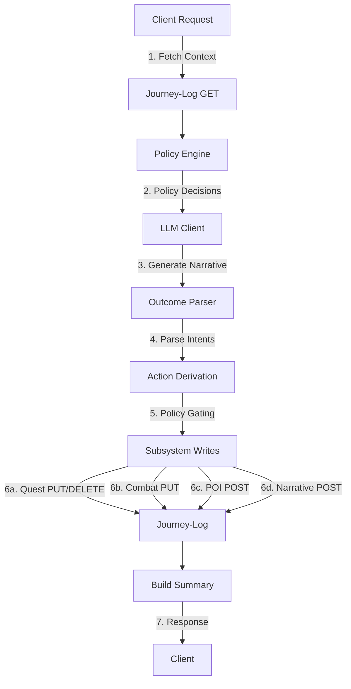
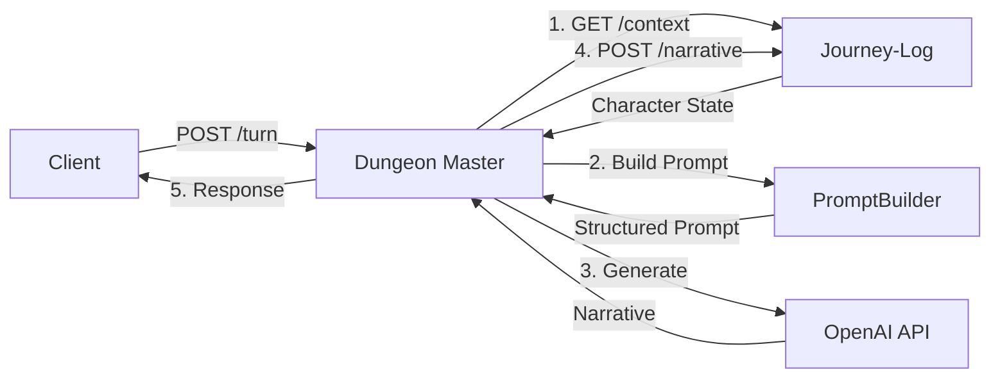

# Dungeon Master Service

AI-powered narrative generation service for dungeon crawling adventures. The Dungeon Master service orchestrates context retrieval from the journey-log service and uses LLM-based generation to create dynamic story responses.

## Overview

This service provides a FastAPI backend that:
- Accepts player turn actions via POST /turn endpoint (synchronous)
- Fetches character context from the journey-log service
- Generates AI narrative responses using OpenAI GPT models
- Provides health check endpoint with optional journey-log connectivity verification

## Character Status Transitions and Game Over Rules

The Dungeon Master service enforces strict character status transitions that govern gameplay:

### Status Ordering

Characters progress through health statuses in strict order:
```
Healthy → Wounded → Dead
```

### Healing Rules

- **Healing Allowed**: Characters can be healed from **Wounded** back to **Healthy** status
- **Resurrection NOT Allowed**: Once a character reaches **Dead** status, they **CANNOT** be revived or healed
- **Death is Final**: The Dead status is permanent and marks the end of the character's journey

### Game Over Logic

When a character reaches **Dead** status:
1. The LLM generates a final narrative describing their demise
2. The session is marked as **OVER** 
3. No new quests, combat, or POIs are offered
4. All intents are set to "none"
5. Gameplay cannot continue for that character

### Enforcement Mechanism

**INSTRUCTION-BASED, Not Validated:**

The Dead status game-over logic relies on **LLM compliance with system prompt instructions**, NOT on deterministic validation by the game engine. This is an intentional design decision.

**How It Works:**
1. **System Prompt Instructions** (`app/prompting/prompt_builder.py`):
   - Explicitly instructs the LLM to set all intents to "none" when status is Dead
   - Instructs the LLM to generate a conclusive, game-over narrative
   - Forbids suggesting new quests, combat, or POIs after death

2. **No Hard Validation:**
   - The game engine does NOT validate that intents are "none" for Dead characters
   - The game engine does NOT prevent quest/combat/POI actions for Dead characters
   - This trusts modern LLMs (GPT-5.1+) to follow explicit instructions

3. **Why Instruction-Based?**
   - ✅ Provides maximum flexibility for narrative generation
   - ✅ Allows LLM to craft appropriate, story-driven game-over scenarios
   - ✅ Simpler architecture (no status-based validation layer)
   - ⚠️ Relies on LLM compliance (may occasionally fail with weaker models)

4. **Client Responsibilities:**
   - Detect Dead status in character context
   - Prevent further turn submissions for Dead characters
   - Display appropriate game-over UI
   - Do not rely solely on intent values to detect game-over state

**Testing:**
- Integration tests in `tests/test_dead_status_integration.py` verify instruction delivery
- Production LLM compliance depends on prompt quality and model capabilities
- See test file documentation for detailed enforcement mechanism explanation

### Example Status Progression

```
Turn 1: Healthy → Player enters dungeon
Turn 5: Healthy → Combat begins
Turn 7: Wounded → Player takes damage
Turn 9: Wounded → Player drinks healing potion → Healthy
Turn 12: Healthy → Player faces boss
Turn 15: Wounded → Boss critically wounds player
Turn 17: Dead → Player dies to boss (GAME OVER)
```

## Quick Start

### Prerequisites

- Python 3.14+ (see `python_dev_versions.txt`)
- Access to a running journey-log service
- OpenAI API key

### Installation

1. Clone the repository:
```bash
git clone https://github.com/AgentFoundryExamples/dungeon-master.git
cd dungeon-master
```

2. Create and activate a virtual environment:
```bash
python -m venv venv
source venv/bin/activate  # On Windows: venv\Scripts\activate
```

3. Install dependencies:
```bash
pip install -r requirements.txt
```

4. Configure environment variables:
```bash
cp .env.example .env
# Edit .env and set required values (see Configuration section below)
```

### Running the Service

Start the development server:
```bash
python -m app.main
```

Or using uvicorn directly:
```bash
uvicorn app.main:app --host 0.0.0.0 --port 8080 --reload
```

The service will be available at:
- API: http://localhost:8080
- Interactive docs (Swagger): http://localhost:8080/docs
- Alternative docs (ReDoc): http://localhost:8080/redoc
- OpenAPI schema: http://localhost:8080/openapi.json

## Configuration

All configuration is managed through environment variables. Copy `.env.example` to `.env` and configure:

### Required Configuration

| Variable | Description | Example |
|----------|-------------|---------|
| `JOURNEY_LOG_BASE_URL` | Base URL for journey-log service | `http://localhost:8000` |
| `OPENAI_API_KEY` | OpenAI API key for LLM requests | `sk-...` |

### Optional Configuration

| Variable | Default | Description |
|----------|---------|-------------|
| `JOURNEY_LOG_TIMEOUT` | `30` | HTTP timeout for journey-log (1-300 seconds) |
| `JOURNEY_LOG_RECENT_N` | `20` | Number of recent turns to fetch (1-100) |
| `OPENAI_MODEL` | `gpt-5.1` | OpenAI model for narrative generation |
| `OPENAI_TIMEOUT` | `60` | HTTP timeout for OpenAI (1-600 seconds) |
| `OPENAI_STUB_MODE` | `false` | Enable stub mode for offline development |
| `HEALTH_CHECK_JOURNEY_LOG` | `false` | Enable journey-log ping in health checks |
| `SERVICE_NAME` | `dungeon-master` | Service name for logging |
| `ENVIRONMENT` | `development` | Environment name for metrics labeling (production/staging/development) |
| `LOG_LEVEL` | `INFO` | Logging level (DEBUG/INFO/WARNING/ERROR/CRITICAL) |
| `LOG_JSON_FORMAT` | `false` | Enable JSON structured logging output |
| `ENABLE_METRICS` | `false` | Enable metrics collection and /metrics endpoint |
| `TURN_LOG_SAMPLING_RATE` | `1.0` | Turn log sampling rate (0.0-1.0, where 1.0 logs all turns) |
| `ENABLE_DEBUG_ENDPOINTS` | `false` | Enable debug endpoints (local development only) |

### PolicyEngine Configuration

The PolicyEngine provides deterministic quest and POI trigger evaluation with configurable parameters and reproducible randomness.

| Variable | Default | Description |
|----------|---------|-------------|
| `QUEST_TRIGGER_PROB` | `0.3` | Quest trigger probability (0.0-1.0) |
| `QUEST_COOLDOWN_TURNS` | `5` | Turns between quest triggers (0 or greater) |
| `POI_TRIGGER_PROB` | `0.2` | POI trigger probability (0.0-1.0) |
| `POI_COOLDOWN_TURNS` | `3` | Turns between POI triggers (0 or greater) |
| `MEMORY_SPARK_PROBABILITY` | `0.2` | Memory spark trigger probability per turn (0.0-1.0) |
| `QUEST_POI_REFERENCE_PROBABILITY` | `0.1` | Probability that a quest references a POI (0.0-1.0) |
| `POI_MEMORY_SPARK_ENABLED` | `false` | Enable fetching random POIs as memory sparks |
| `POI_MEMORY_SPARK_COUNT` | `3` | Number of random POIs to fetch (1-20) |
| `RNG_SEED` | (unset) | Optional RNG seed for deterministic behavior |

### POI Memory Sparks

POI Memory Sparks is an optional feature that probabilistically fetches random POIs from a character's history at the start of turns and injects them into the LLM prompt. This helps the LLM:
- Recall previously discovered locations
- Reference past POIs in narratives naturally
- Create more connected and immersive storytelling
- Optionally connect quests to prior POIs for deeper world building

**Configuration:**

```bash
# Enable memory sparks
POI_MEMORY_SPARK_ENABLED=true

# Number of random POIs to fetch when triggered (1-20, default: 3)
POI_MEMORY_SPARK_COUNT=5

# Probability of fetching memory sparks per turn (0.0-1.0, default: 0.2)
MEMORY_SPARK_PROBABILITY=0.2

# Probability that a triggered quest references a prior POI (0.0-1.0, default: 0.1)
QUEST_POI_REFERENCE_PROBABILITY=0.1
```

**How it works:**
1. At the start of each turn, the PolicyEngine evaluates whether to fetch memory sparks using a probabilistic roll
2. If the roll passes (20% chance by default), N random POIs are fetched from journey-log
3. These POIs are stored in `context.memory_sparks` for prompt injection
4. The prompt builder includes these in a "MEMORY SPARKS" section of the LLM context
5. When a quest is triggered and memory sparks are available, a second roll (10% chance by default) determines if the quest should reference one of the POIs
6. If the quest POI reference roll passes, a random POI is selected and injected into the quest's details for narrative context
7. Errors are non-fatal - if the fetch fails, memory_sparks will be empty and the turn continues

**Tuning Guidance:**
- Set `MEMORY_SPARK_PROBABILITY=0.0` to disable memory sparks without disabling the feature entirely
- Set `QUEST_POI_REFERENCE_PROBABILITY=0.0` to disable POI references in quests while keeping memory sparks
- Higher probabilities (e.g., 0.5-1.0) create denser connections between quests and locations
- Lower probabilities (e.g., 0.05-0.15) create occasional but memorable callbacks
- Use `RNG_SEED` in tests for deterministic behavior

**Performance considerations:**
- Memory spark retrieval adds ~50-100ms to turn latency
- The journey-log `/pois/random` endpoint is optimized for fast sampling
- Non-fatal errors ensure turn processing is never blocked

## Rate Limiting and Resilience

The service implements comprehensive safeguards to prevent runaway resource usage and handle transient failures gracefully.

### Rate Limiting

**Per-Character Rate Limiting**
- Prevents individual characters from exhausting service resources
- Configured via `MAX_TURNS_PER_CHARACTER_PER_SECOND` (default: 2.0)
- Uses token bucket algorithm for smooth rate limiting
- Returns HTTP 429 with `Retry-After` header when limit exceeded
- Independent limits per character (one character can't block others)

**Global LLM Concurrency Limiting**
- Prevents API rate limit exhaustion from concurrent requests
- Configured via `MAX_CONCURRENT_LLM_CALLS` (default: 10)
- Queues requests when limit is reached (FIFO)
- Applies across all characters

**Rate Limit Response (HTTP 429)**:
```json
{
  "detail": {
    "error": "rate_limit_exceeded",
    "message": "Too many requests for this character. Please wait 0.5 seconds.",
    "retry_after_seconds": 0.5,
    "character_id": "550e8400-e29b-41d4-a716-446655440000"
  }
}
```

### Retry and Backoff

The service automatically retries transient failures with exponential backoff:

**LLM Client Retries**
- **Retried**: Timeouts, rate limits (429), server errors (5xx), connection errors
- **Not Retried**: Authentication errors (401), bad requests (400), permission denied (403)
- Exponential backoff: base delay × 2^(attempt-1), capped at max delay
- Configuration:
  - `LLM_MAX_RETRIES` (default: 3)
  - `LLM_RETRY_DELAY_BASE` (default: 1.0 seconds)
  - `LLM_RETRY_DELAY_MAX` (default: 30.0 seconds)

**Journey-Log Client Retries**
- **GET requests only**: Context fetching, random POI retrieval
- **Never retried**: POST, PUT, DELETE (to prevent duplicates)
- Same retry logic as LLM client for GET requests
- Configuration:
  - `JOURNEY_LOG_MAX_RETRIES` (default: 3)
  - `JOURNEY_LOG_RETRY_DELAY_BASE` (default: 0.5 seconds)
  - `JOURNEY_LOG_RETRY_DELAY_MAX` (default: 10.0 seconds)

**Why No Retries for Mutations?**
- POST/PUT/DELETE are not idempotent
- Retrying could create duplicate quests, POIs, or narrative entries
- Failed mutations are logged and reported in subsystem_summary
- The narrative always completes even if subsystem writes fail

### Operational Tuning

**Conservative Defaults**
- Defaults are intentionally conservative to prevent resource exhaustion
- Tune based on your infrastructure and traffic patterns
- Monitor metrics to identify appropriate limits

**Tuning Guidelines**:

| Metric | Symptom | Action |
|--------|---------|--------|
| High rate limit hits | Legitimate users throttled | Increase `MAX_TURNS_PER_CHARACTER_PER_SECOND` |
| LLM API rate limits | 429 from OpenAI | Decrease `MAX_CONCURRENT_LLM_CALLS` or upgrade API tier |
| Long turn latencies | Requests queued | Increase `MAX_CONCURRENT_LLM_CALLS` (if API tier allows) |
| Frequent timeouts | Slow LLM responses | Increase `OPENAI_TIMEOUT` or reduce prompt size |
| Retry exhaustion | Journey-log unreachable | Increase `JOURNEY_LOG_TIMEOUT` or `JOURNEY_LOG_MAX_RETRIES` |

**Environment-Specific Configuration**:
```bash
# Production (higher limits, shorter timeouts)
MAX_TURNS_PER_CHARACTER_PER_SECOND=5.0
MAX_CONCURRENT_LLM_CALLS=50
OPENAI_TIMEOUT=30
LLM_MAX_RETRIES=2

# Development (lower limits, longer timeouts for debugging)
MAX_TURNS_PER_CHARACTER_PER_SECOND=1.0
MAX_CONCURRENT_LLM_CALLS=2
OPENAI_TIMEOUT=120
LLM_MAX_RETRIES=5
```

### Observability

**Metrics Tracked** (when `ENABLE_METRICS=true`):
- `rate_limit_exceeded`: Per-character rate limit hits
- `llm_retry_*`: LLM retry attempts by error type
- `journey_log_retry_*`: Journey-log retry attempts
- `llm_timeout_exhausted`: LLM requests that timed out after all retries
- `journey_log_timeout_exhausted`: Journey-log requests that timed out after all retries

**Log Events**:
- Rate limit exceeded (WARNING): Includes character_id, retry_after_seconds
- Retry attempts (WARNING): Includes attempt number, delay, error type
- Retry exhaustion (ERROR): Includes total attempts, final error

Access metrics at `/metrics` endpoint (requires `ENABLE_METRICS=true`).

## API Usage

### Turn Processing

Process player turns with synchronous request-response flow:

```bash
curl -X POST http://localhost:8080/turn \
  -H "Content-Type: application/json" \
  -d '{
    "character_id": "550e8400-e29b-41d4-a716-446655440000",
    "user_action": "I search the ancient temple for clues"
  }'
```

**Response** (application/json):
```json
{
  "narrative": "You carefully search the temple's walls and discover ancient runes...",
  "intents": {
    "quest_intent": {"action": "none"},
    "combat_intent": {"action": "none"},
    "poi_intent": {
      "action": "create",
      "name": "Ancient Temple",
      "description": "A mysterious temple with glowing runes"
    }
  },
  "subsystem_summary": {
    "quest_change": {"action": "none", "success": null, "error": null},
    "combat_change": {"action": "none", "success": null, "error": null},
    "poi_created": {"action": "created", "success": true, "error": null},
    "narrative_persisted": true
  }
}
```

## Prompt Structure

The DungeonMaster service constructs prompts for the LLM with deterministic sections that provide complete game context while maintaining consistent token usage. Understanding the prompt structure is crucial for debugging LLM responses and verifying context completeness.

### Prompt Sections

The prompt is built from two parts: system instructions and user prompt.

**System Instructions:**
- Role definition (narrative engine for text adventure)
- JSON schema for DungeonMasterOutcome (structured output)
- Example JSON output
- Guidelines for narrative and intents
- Clarification that subsystem eligibility is deterministic (handled by game logic, not LLM)

**User Prompt Sections (deterministic order):**

1. **CHARACTER STATUS** (always present)
   - Current health status (e.g., "Healthy", "Wounded", "Dead")

2. **CURRENT LOCATION** (always present)
   - Location display name and ID
   - Example: "The Nexus (origin:nexus)"

3. **ACTIVE QUEST** (conditional)
   - Quest name, description, completion state
   - Requirements list if present
   - Only shown when character has an active quest

4. **COMBAT STATE** (conditional)
   - Current turn number
   - Enemy list with name, status, weapon
   - Only shown when combat is active

5. **MEMORY SPARKS (Previously Discovered Locations)** (conditional)
   - List of random POIs from character's history
   - Sorted by timestamp descending (newest first) for determinism
   - Each POI shows: name, truncated description (200 chars max), tags (5 max)
   - Only shown when POI_MEMORY_SPARK_ENABLED=true and POIs exist
   - Helps LLM recall and reference previously discovered locations

6. **POLICY HINTS** (conditional)
   - Quest trigger status (ALLOWED/NOT ALLOWED)
   - POI creation status (ALLOWED/NOT ALLOWED)
   - Eligibility reasons when not allowed
   - Only shown after PolicyEngine evaluation (during turn processing)
   - Guides LLM to respect deterministic policy decisions

7. **RECENT NARRATIVE HISTORY** (conditional)
   - Last 20 turns (configurable via JOURNEY_LOG_RECENT_N)
   - Player action and GM response per turn
   - Long text truncated (200 chars action, 300 chars response)
   - Empty label shown if no history available

8. **PLAYER ACTION** (always present)
   - The current player action to respond to

### Section Hiding Behavior

Sections are hidden cleanly when data is absent:
- No active quest → ACTIVE QUEST section omitted
- No combat → COMBAT STATE section omitted
- No memory sparks → MEMORY SPARKS section omitted
- No policy hints → POLICY HINTS section omitted (only in orchestrated turns)
- No history → Section shows "(No recent history)"

This ensures:
- Token usage is optimized (don't send empty data)
- LLM doesn't see confusing empty sections
- Prompt structure remains stable and predictable

### Token Management

Estimated token usage by section:
- **System instructions + schema**: ~9KB (~2,250 tokens)
- **Character status + location**: ~50 tokens
- **Active quest**: ~100-200 tokens (if present)
- **Combat state**: ~50-150 tokens per enemy
- **Memory sparks**: ~100-300 tokens per POI (description truncated)
- **Policy hints**: ~100 tokens (if present)
- **History**: ~50-100 tokens per turn × 20 turns = ~1,000-2,000 tokens

**Total typical prompt**: 4,000-6,000 tokens (well within GPT-5.1's 128K context window)

**Managing token growth:**
- Reduce JOURNEY_LOG_RECENT_N (default 20) to show fewer history turns
- Reduce POI_MEMORY_SPARK_COUNT (default 3) to fetch fewer POIs
- Memory sparks truncate descriptions to 200 chars automatically
- History truncates long actions/responses automatically

### Debugging Prompts

To see the exact prompt sent to the LLM:

1. Enable DEBUG logging:
```bash
LOG_LEVEL=DEBUG
```

2. Look for log entries containing "Building LLM prompt" or "Calling LLM" with prompt details

3. Use the `/debug/parse_llm` endpoint (if ENABLE_DEBUG_ENDPOINTS=true) to test LLM response parsing

**Important**: Debug endpoints are for local development only and should never be enabled in production.

## Policy Engine Debugging

The PolicyEngine makes deterministic decisions about when to trigger quests and POIs independently of LLM outputs. This section explains how to debug and test policy behavior.

### Understanding Policy Decisions

Each turn, the PolicyEngine evaluates two independent decisions:
1. **Quest Trigger**: Should a new quest be offered?
2. **POI Trigger**: Should a new point of interest be created?

These decisions are based on:
- **Eligibility**: Cooldown periods and game state (e.g., already has active quest)
- **Probability**: Configurable random roll (e.g., 30% chance)
- **Determinism**: Optional seeded RNG for reproducible testing

Policy decisions are logged but **never exposed** to players in the API response.

### Enabling Debug Logging

To see detailed policy decision logs:

1. Set log level to DEBUG in `.env`:
```bash
LOG_LEVEL=DEBUG
```

2. Run the service and watch logs:
```bash
python -m app.main
```

3. Look for log entries like:
```
Quest trigger evaluation: character_id=..., eligible=True, roll_passed=False, reasons=none
POI trigger evaluation: character_id=..., eligible=True, roll_passed=True, reasons=none
Policy decisions evaluated | quest_eligible=True quest_roll_passed=False poi_eligible=True poi_roll_passed=True
```

### Using Deterministic Seeds

For reproducible testing and debugging, set an RNG seed:

```bash
# In .env
RNG_SEED=42
```

With a seed set:
- Each character gets their own deterministic RNG sequence
- Restarting the service produces identical roll results
- Tests can verify exact policy behavior

**Important**: Don't use seeds in production - they reduce randomness security.

### Policy Profiles

The `.env.example` file includes several pre-configured profiles for common testing scenarios:

#### High Frequency Profile
Test frequent quest and POI triggers:
```bash
QUEST_TRIGGER_PROB=0.9
QUEST_COOLDOWN_TURNS=1
POI_TRIGGER_PROB=0.8
POI_COOLDOWN_TURNS=1
RNG_SEED=42
```

#### Low Frequency Profile
Test rare triggers and long cooldowns:
```bash
QUEST_TRIGGER_PROB=0.1
QUEST_COOLDOWN_TURNS=10
POI_TRIGGER_PROB=0.1
POI_COOLDOWN_TURNS=10
RNG_SEED=42
```

#### Deterministic Testing Profile
Guarantee triggers for testing:
```bash
QUEST_TRIGGER_PROB=1.0
QUEST_COOLDOWN_TURNS=0
POI_TRIGGER_PROB=1.0
POI_COOLDOWN_TURNS=0
RNG_SEED=999
```

#### Disabled Profile
Completely disable triggers:
```bash
QUEST_TRIGGER_PROB=0.0
QUEST_COOLDOWN_TURNS=999
POI_TRIGGER_PROB=0.0
POI_COOLDOWN_TURNS=999
```

### Interpreting Log Output

Policy decision logs include these key fields:

- **eligible**: Whether the trigger meets basic requirements (cooldown, no active quest, etc.)
- **roll_passed**: Whether the random roll succeeded (based on configured probability)
- **reasons**: Why the trigger was ineligible (if applicable)

Example log analysis:
```
# Quest was eligible but roll failed (70% chance to fail with default 0.3 probability)
Quest trigger evaluation: eligible=True, roll_passed=False

# POI was ineligible due to cooldown
POI trigger evaluation: eligible=False, roll_passed=False, reasons=cooldown_not_met (turns=2, required=3)
```

### Testing Policy Decisions

The test suite includes comprehensive policy tests:

```bash
# Run policy engine unit tests
python -m pytest tests/test_policy_engine.py -v

# Run integration tests with policy decisions
python -m pytest tests/test_turn_integration.py -v

# Run prompt builder tests (verifies policy hints)
python -m pytest tests/test_prompt_builder.py -v

# Run end-to-end multi-turn tests with probabilistic validation
python -m pytest tests/test_turn_integration.py::test_multi_turn_quest_trigger_frequency -v
python -m pytest tests/test_turn_integration.py::test_multi_turn_poi_trigger_frequency -v
```

Key test categories:
- **Eligibility permutations**: Quest present/absent, combat active, cooldown boundaries
- **Seeded randomness**: Deterministic outcomes with seeds
- **Profile overrides**: High/low frequency settings
- **Integration**: Policy hints in prompts, failed rolls blocking writes
- **Multi-turn probabilistic tests**: Validate trigger frequencies over 50-100 turns with statistical bounds
- **State consistency**: Verify cooldown enforcement and journey-log persistence across turns
- **Failure resilience**: Test behavior when subsystem writes fail intermittently

See [Turn Lifecycle Documentation](#turn-lifecycle-documentation) for detailed testing guarantees.

### Verifying Policy Independence

To verify that policy decisions are independent of LLM outputs:

1. Set `QUEST_TRIGGER_PROB=0.0` (disable quest triggers)
2. Make a turn request asking for a quest: `"I ask the innkeeper for a quest"`
3. Check logs - quest should be blocked despite LLM potentially suggesting one
4. Verify response doesn't include quest-related updates

The LLM may still generate quest-related narrative, but the quest won't be persisted to journey-log due to the failed policy roll.

## API Endpoints

### POST /turn

Process a player turn and generate AI-powered narrative response.

**Orchestration Flow:**

The `/turn` endpoint uses a `TurnOrchestrator` to enforce deterministic sequencing:

1. **Fetch Context**: Retrieves character context from journey-log service (recent_n=20, include_pois=false)
2. **Policy Decisions**: Evaluates quest and POI trigger eligibility and rolls
3. **LLM Generation**: Calls OpenAI Responses API (gpt-5.1) for narrative generation with policy hints
4. **Parse Intents**: Validates LLM response against DungeonMasterOutcome schema
5. **Derive Actions**: Maps intents to subsystem actions with policy gating and context validation
6. **Execute Writes** (deterministic order):
   - Quest writes (PUT/DELETE) - if action derived
   - Combat writes (PUT) - if action derived
   - POI writes (POST) - if action derived
   - Narrative write (POST) - always attempted
7. **Build Summary**: Creates TurnSubsystemSummary with success/failure status for each action
8. **Return Response**: Narrative, intents, and subsystem_summary



**Failure Strategy:**

- **Continue on Error**: Subsystem write failures are logged but don't block narrative response
- **No Retry on DELETE**: Destructive operations (quest DELETE) are never automatically retried
- **Summary Tracking**: All failures are captured in `subsystem_summary` for debugging
- **200 with Failures**: Returns HTTP 200 even if some subsystem writes fail (check summary for details)

**Request:**
```json
{
  "character_id": "550e8400-e29b-41d4-a716-446655440000",
  "user_action": "I search the room for treasure",
  "trace_id": "optional-trace-id"
}
```

**Response:**
```json
{
  "narrative": "You search the dimly lit room and discover a glinting treasure chest...",
  "intents": {
    "quest_intent": {"action": "none"},
    "combat_intent": {"action": "none"},
    "poi_intent": {
      "action": "create",
      "name": "Hidden Chamber",
      "description": "A secret room filled with treasures"
    },
    "meta": {
      "player_mood": "excited",
      "pacing_hint": "normal"
    }
  },
  "subsystem_summary": {
    "quest_change": {
      "action": "none",
      "success": null,
      "error": null
    },
    "combat_change": {
      "action": "none",
      "success": null,
      "error": null
    },
    "poi_created": {
      "action": "created",
      "success": true,
      "error": null
    },
    "narrative_persisted": true,
    "narrative_error": null
  }
}
```

**Response Fields:**
- `narrative` (string, required): AI-generated narrative text that is persisted to journey-log
- `intents` (object, optional): Structured intents from LLM output (informational only, not persisted)
  - Present when LLM response is valid
  - Null when LLM response fails validation
  - Contains quest, combat, POI, and meta intents
  - **Important**: Only `narrative` is persisted to journey-log; intents are descriptive and informational
- `subsystem_summary` (object, optional): Summary of subsystem changes made during this turn
  - `quest_change`: Quest action result (offered/completed/abandoned/none)
  - `combat_change`: Combat action result (started/continued/ended/none)
  - `poi_created`: POI action result (created/referenced/none)
  - `narrative_persisted`: Whether narrative was successfully saved
  - `narrative_error`: Error message if narrative persistence failed
  - Each action includes `success` (true/false/null) and `error` (string/null) fields

**Status Codes:**
- `200`: Success - narrative generated (check subsystem_summary for write failures)
- `400`: Invalid request (malformed UUID, validation error)
- `404`: Character not found in journey-log
- `502`: Journey-log or LLM service error (during context fetch or LLM generation)
- `504`: Timeout fetching context or generating narrative

### GET /health

Check service health status with optional journey-log connectivity verification.

**Response (healthy):**
```json
{
  "status": "healthy",
  "service": "dungeon-master",
  "journey_log_accessible": true
}
```

**Response (degraded):**
```json
{
  "status": "degraded",
  "service": "dungeon-master",
  "journey_log_accessible": false
}
```

**Status Codes:**
- `200`: Service is operational (healthy or degraded)

Note: The health endpoint returns 200 even when degraded to avoid restart loops. Use the `status` field to determine actual health.

### GET /metrics

Get service metrics including request counts, error rates, and operation latencies (requires `ENABLE_METRICS=true`).

**Response:**
```json
{
  "uptime_seconds": 3600.0,
  "requests": {
    "total": 150,
    "success": 145,
    "errors": 5,
    "by_status_code": {
      "200": 145,
      "404": 3,
      "502": 2
    }
  },
  "errors": {
    "by_type": {
      "character_not_found": 3,
      "llm_error": 2
    }
  },
  "latencies": {
    "turn": {
      "count": 145,
      "avg_ms": 1250.5,
      "min_ms": 800.2,
      "max_ms": 3200.8
    },
    "llm_call": {
      "count": 145,
      "avg_ms": 950.3,
      "min_ms": 600.1,
      "max_ms": 2500.5
    },
    "journey_log_fetch": {
      "count": 145,
      "avg_ms": 150.2,
      "min_ms": 80.5,
      "max_ms": 450.1
    }
  }
}
```

**Status Codes:**
- `200`: Metrics available
- `404`: Metrics endpoint disabled (set `ENABLE_METRICS=true`)

### POST /debug/parse_llm

**WARNING: Local development only. Do NOT enable in production.**

Test the LLM response parser with raw JSON payloads (requires `ENABLE_DEBUG_ENDPOINTS=true`).

This debug endpoint allows developers to submit raw LLM responses and receive detailed validation results, making it easier to test and debug the outcome parser behavior.

**Request:**
```json
{
  "llm_response": "{\"narrative\": \"You discover a treasure chest.\", \"intents\": {...}}",
  "trace_id": "debug-test-123"
}
```

**Response:**
```json
{
  "is_valid": true,
  "narrative": "You discover a treasure chest.",
  "has_outcome": true,
  "error_type": null,
  "error_details": null,
  "intents_summary": {
    "has_quest_intent": false,
    "has_combat_intent": false,
    "has_poi_intent": true,
    "has_meta_intent": true
  },
  "schema_version": 1
}
```

**Status Codes:**
- `200`: Parse results returned (regardless of validation outcome)
- `400`: Invalid request (missing required fields)
- `404`: Debug endpoints disabled (set `ENABLE_DEBUG_ENDPOINTS=true`)

## Observability

### Structured Logging

The service provides comprehensive structured logging with correlation IDs for request tracking.

#### Log Fields

All logs include:
- `timestamp`: ISO 8601 timestamp
- `level`: Log level (DEBUG, INFO, WARNING, ERROR, CRITICAL)
- `logger`: Logger name (module path)
- `message`: Log message
- `request_id`: Request correlation ID (from X-Trace-Id or X-Request-Id header, or auto-generated UUID)
- `character_id`: Character UUID (when processing a turn)

#### Log Phases

The service logs all major phases of turn processing:
1. **Request Start**: Incoming request with method, path, and client IP
2. **Context Fetch**: Journey-log context retrieval with duration
3. **Prompt Build**: Prompt construction phase
4. **LLM Call**: Narrative generation with model and duration
5. **Narrative Save**: Persistence to journey-log with duration
6. **Request Complete**: Final response with status code and total duration

#### JSON Logging

Enable JSON structured logging for easier parsing by log aggregation tools:
```bash
LOG_JSON_FORMAT=true
```

Example JSON log:
```json
{
  "timestamp": "2025-01-16T10:30:45.123Z",
  "level": "INFO",
  "logger": "app.api.routes",
  "message": "Phase completed: llm_call",
  "request_id": "550e8400-e29b-41d4-a716-446655440000",
  "character_id": "7c9e6679-7425-40de-944b-e07fc1f90ae7",
  "duration_ms": "1250.45"
}
```

#### Secret Redaction

API keys and sensitive data are automatically redacted from logs:
- OpenAI API keys (`sk-***REDACTED***`)
- Bearer tokens
- Generic API key patterns

#### Correlation IDs

Requests can include correlation IDs for distributed tracing:
- **X-Trace-Id header**: Client-provided trace ID (highest priority)
- **X-Request-Id header**: Alternative request ID header
- **Auto-generated**: UUID generated if no header provided

All logs and responses include the request ID for end-to-end tracing.

### Error Handling

The service returns structured error responses for all failure scenarios:

```json
{
  "detail": {
    "error": {
      "type": "character_not_found",
      "message": "Character 550e8400-e29b-41d4-a716-446655440000 not found in journey-log",
      "request_id": "7c9e6679-7425-40de-944b-e07fc1f90ae7"
    }
  }
}
```

#### Error Types

Machine-readable error types for automated handling:
- `character_not_found`: Character doesn't exist (404)
- `journey_log_timeout`: Journey-log service timeout (504)
- `journey_log_error`: Journey-log communication failure (502)
- `llm_timeout`: LLM service timeout (504)
- `llm_response_error`: Invalid LLM response (502)
- `llm_error`: LLM generation failure (502)
- `internal_error`: Unexpected error (500)

### Metrics Collection

Enable optional in-memory metrics collection:
```bash
ENABLE_METRICS=true
```

When enabled, the service tracks:
- **Request Counts**: Total, success, errors by status code
- **Error Counts**: By error type
- **Latencies**: Min, max, average for operations
  - `turn`: Complete turn processing time
  - `llm_call`: LLM narrative generation time
  - `journey_log_fetch`: Context retrieval time
  - `journey_log_persist`: Narrative persistence time

Access metrics via GET /metrics endpoint.

**Note**: Metrics are stored in-memory and reset on service restart. For production monitoring, integrate with Prometheus or other observability platforms.

## Intent Normalization

The service includes robust intent normalization to handle cases where the LLM produces incomplete or missing intent data, while still allowing subsystem actions when policy triggers fire.

### Quest Intent Normalization

When the policy engine triggers a quest opportunity but the LLM intent is missing or incomplete, the `OutcomeParser.normalize_quest_intent()` method provides deterministic fallbacks:

- **Missing Intent with Policy Trigger**: Creates minimal "offer" intent with fallback title and summary
- **Missing Title**: Uses "A New Opportunity" as fallback
- **Missing Summary**: Uses "An opportunity for adventure presents itself." as fallback
- **Missing Details**: Uses empty dict as fallback

**Example:**
```python
# Policy triggered but LLM returned no quest intent
# Parser creates: QuestIntent(
#   action="offer",
#   quest_title="A New Opportunity",
#   quest_summary="An opportunity for adventure presents itself.",
#   quest_details={}
# )
```

### POI Intent Normalization

When the policy engine triggers a POI opportunity but the LLM intent is missing or incomplete, the `OutcomeParser.normalize_poi_intent()` method provides deterministic fallbacks:

- **Missing Intent with Policy Trigger**: Creates minimal "create" intent with location name or fallback
- **Missing Name**: Uses current location name or "A Notable Location" as fallback
- **Missing Description**: Uses "An interesting location worth remembering." as fallback
- **Long Name**: Trims to 200 characters (journey-log max)
- **Long Description**: Trims to 2000 characters (journey-log max)
- **Missing Tags**: Uses empty list as fallback

**Example:**
```python
# Policy triggered but LLM returned incomplete POI intent
# Parser creates: POIIntent(
#   action="create",
#   name="The Ancient Temple",  # from context.location
#   description="An interesting location worth remembering.",
#   reference_tags=[]
# )
```

This ensures that policy-driven subsystem triggers (quests and POIs) are never lost due to LLM parsing issues, while maintaining deterministic behavior for debugging and testing.

### LLM Response Parsing and Validation

The service uses a robust parser (`OutcomeParser`) that defensively validates LLM responses against the `DungeonMasterOutcome` schema while ensuring narrative text is always preserved.

#### Parser Behavior

**On Success:**
- Validates JSON structure against `DungeonMasterOutcome` schema
- Returns typed outcome with structured intents
- Logs successful parse with schema version

**On Failure:**
- **JSON Decode Errors**: Uses raw response text as narrative fallback
- **Validation Errors**: Extracts narrative from partial JSON, defaulting intents to None
- **Schema Violations**: Logs detailed errors with schema version, truncated payload (max 500 chars), and validation error list
- **Always Returns Narrative**: Ensures journey-log persistence succeeds even with invalid intents

#### Schema Conformance Metrics

When metrics are enabled (`ENABLE_METRICS=true`), the parser tracks schema conformance rate:

```json
{
  "schema_conformance": {
    "total_parses": 150,
    "successful_parses": 145,
    "failed_parses": 5,
    "conformance_rate": 0.9667
  }
}
```

This helps monitor LLM reliability and identify when prompt engineering adjustments may be needed.

#### Validation Error Logging

Failed validations log detailed diagnostic information:

```
LLM response failed schema validation | schema_version=1 error_type=validation_error 
error_count=1 error_details=["intents.quest_intent.action: literal_error - Input should be 
'none', 'offer', 'complete' or 'abandon'"] payload_preview={"narrative": "...", ...} (truncated)
```

**Logged Information:**
- `schema_version`: Current outcome schema version for tracking evolution
- `error_type`: Classification (json_decode_error, validation_error, unexpected_error)
- `error_details`: Specific field-level validation failures
- `payload_preview`: Truncated response (secrets redacted, max 500 chars)

#### Fallback Narrative Extraction

The parser uses multiple strategies to preserve narrative:

1. **Direct Field Extraction**: Attempts to get `narrative` field from partial JSON
2. **Pattern Matching**: Searches for narrative patterns in malformed JSON
3. **Raw Text Fallback**: Uses entire response text if no structure found
4. **Safe Default**: Returns error message only if text too short or looks like error

**Example Edge Cases:**
- **Invalid Action Literal**: `{"action": "ofer"}` → Logs validation error, extracts narrative
- **Partial JSON Stream**: `{"narrative": "You enter...` → Treated as JSON decode error
- **Empty Response**: → Returns `"[Unable to generate narrative - LLM response was invalid]"`

#### Testing

Comprehensive tests verify parser behavior:
- 23 unit tests in `tests/test_outcome_parser.py`
- 12 acceptance criteria tests in `tests/test_acceptance_criteria.py`
- Integration tests with full request flow

**Note**: Metrics are stored in-memory and reset on service restart. For production monitoring, integrate with Prometheus or other observability platforms.

### Health Checks

The /health endpoint provides service health status:
- Returns `healthy` when all systems operational
- Returns `degraded` when journey-log is unreachable (if health checks enabled)
- Always returns HTTP 200 to avoid restart loops

Enable journey-log health checks:
```bash
HEALTH_CHECK_JOURNEY_LOG=true
```

## Development

### Code Quality

Format code with ruff:
```bash
ruff format .
ruff check . --fix
```

Type check with mypy:
```bash
mypy app/
```

### Testing

The project includes comprehensive unit and integration tests for all components. Tests use mocked dependencies to avoid hitting live services.

#### Running Tests

Run all tests:
```bash
pytest
```

Run with verbose output:
```bash
pytest -v
```

Run specific test file:
```bash
pytest tests/test_turn_integration.py -v
```

Run specific test:
```bash
pytest tests/test_turn_integration.py::test_turn_endpoint_full_flow_stub_mode -v
```

Run with coverage:
```bash
pytest --cov=app tests/
```

#### Test Categories

**Unit Tests:**
- `test_policy_engine.py`: PolicyEngine trigger logic and RNG seeding
- `test_policy_config.py`: Configuration validation and defaults
- `test_outcome_parser.py`: LLM response parsing and fallback handling
- `test_llm_client.py`: LLM client retry logic and streaming
- `test_journey_log_client.py`: Journey-log API client interactions
- `test_metrics.py`: Metrics collection and export

**Integration Tests:**
- `test_turn_integration.py`: Full turn orchestration flow (single and multi-turn)
- `test_policy_integration.py`: Policy evaluation with turn orchestration
- `test_quest_integration.py`: Quest lifecycle (offer, progress, complete)
- `test_poi_memory_sparks.py`: POI memory spark retrieval and trigger frequency

**End-to-End Multi-Turn Tests:**
- `test_multi_turn_quest_trigger_frequency`: Validates quest trigger rates over 100 turns with statistical bounds
- `test_multi_turn_poi_trigger_frequency`: Validates POI trigger rates over 100 turns
- `test_multi_turn_narrative_history_ordering`: Verifies narrative history maintains correct ordering
- `test_multi_turn_state_consistency_with_failures`: Tests resilience when subsystem writes fail intermittently
- `test_multi_turn_metrics_capture`: Validates metrics are captured correctly across turns

These end-to-end tests simulate real gameplay scenarios with probabilistic policy decisions and verify:
- Trigger frequencies stay within configured confidence intervals
- Cooldown enforcement across multiple turns
- State consistency even when safeguards/rate limits engage
- Journey-log persistence and recovery from transient failures

#### Integration Tests for /turn Endpoint

The `/turn` endpoint integration tests validate the complete orchestration flow:

**Success Path Tests:**
- `test_turn_endpoint_full_flow_stub_mode`: Verifies the full flow returns mocked LLM narrative
  - GET `/characters/{id}/context` called once with `recent_n=20`, `include_pois=false`
  - POST `/characters/{id}/narrative` called once with `user_action` and generated `narrative`
  - Returns the expected narrative response

**Failure Path Tests:**
- `test_turn_endpoint_character_not_found`: Character not found (404) returns structured error
- `test_turn_endpoint_journey_log_timeout`: Journey-log timeout (504) returns structured error
- `test_turn_endpoint_journey_log_error_no_llm_call`: Journey-log error stops before LLM call
- `test_turn_endpoint_llm_failure_skips_narrative_write`: LLM failure skips narrative persistence
- `test_turn_endpoint_persist_failure_returns_error`: Narrative persistence failure returns 502

**Edge Cases:**
- `test_turn_endpoint_with_trace_id`: Trace ID propagation to downstream services
- `test_turn_endpoint_optional_context_fields`: Optional fields (quest/combat) handle None/absent
- `test_turn_endpoint_metrics_logging_no_errors`: Metrics/logging hooks don't throw errors

#### Test Fixtures

The `tests/conftest.py` module provides shared fixtures:

- **`test_env`**: Test environment variables (OPENAI_STUB_MODE=true, etc.)
- **`client`**: FastAPI TestClient with mocked dependencies
- **`mock_journey_log_context`**: Sample journey-log context response

**Custom Mocking:**

To mock specific journey-log responses:
```python
from unittest.mock import AsyncMock, patch
from httpx import Response

def test_custom(client):
    mock_response = MagicMock(spec=Response)
    mock_response.json.return_value = {...}
    
    with patch('httpx.AsyncClient.get', new_callable=AsyncMock) as mock_get:
        mock_get.return_value = mock_response
        response = client.post("/turn", json={...})
```

**Note:** All tests use stub mode for LLM to avoid real OpenAI API calls. Journey-log interactions are mocked at the HTTP client level.

## Deployment

### Docker

A Dockerfile following GCP Cloud Run best practices:

```dockerfile
FROM python:3.14-slim

WORKDIR /app

# Copy requirements and install dependencies
COPY requirements.txt .
RUN pip install --no-cache-dir -r requirements.txt

# Copy application code
COPY app/ ./app/

# Set environment for production
ENV LOG_LEVEL=INFO

# Run on port 8080 (Cloud Run default)
CMD ["uvicorn", "app.main:app", "--host", "0.0.0.0", "--port", "8080"]
```

### Google Cloud Run

Deploy to Cloud Run:

```bash
# Build and push to Artifact Registry
gcloud builds submit --tag us-central1-docker.pkg.dev/PROJECT_ID/dungeon-master/app:latest

# Deploy to Cloud Run
gcloud run deploy dungeon-master \
  --image us-central1-docker.pkg.dev/PROJECT_ID/dungeon-master/app:latest \
  --region us-central1 \
  --platform managed \
  --set-env-vars JOURNEY_LOG_BASE_URL=https://journey-log-xyz.run.app \
  --set-secrets OPENAI_API_KEY=openai-key:latest \
  --allow-unauthenticated
```

See `gcp_deployment_reference.md` for detailed deployment instructions.

## Admin Operations

### Dynamic Policy Configuration

The service supports runtime policy configuration changes without restart through the PolicyConfigManager. This enables live tuning of quest and POI trigger probabilities and cooldowns.

#### Configuration File Format

Create a JSON file with policy parameters (see `policy_config.json.example`):

```json
{
  "quest_trigger_prob": 0.5,
  "quest_cooldown_turns": 10,
  "poi_trigger_prob": 0.3,
  "poi_cooldown_turns": 5
}
```

#### Operational Playbook: Live Policy Tuning

**Method 1: File-based reload**

1. Set `POLICY_CONFIG_FILE` environment variable to config file path
2. Start service (loads config on startup)
3. Modify config file when needed
4. Call `POST /admin/policy/reload` to reload (omit config in request body)

**Method 2: API-based reload**

1. Enable admin endpoints: `ADMIN_ENDPOINTS_ENABLED=true`
2. Call `POST /admin/policy/reload` with config in request body

**Example: Increase quest trigger rate**

```bash
curl -X POST http://localhost:8080/admin/policy/reload \
  -H "Content-Type: application/json" \
  -d '{
    "config": {
      "quest_trigger_prob": 0.7,
      "quest_cooldown_turns": 3,
      "poi_trigger_prob": 0.2,
      "poi_cooldown_turns": 3
    },
    "actor": "admin@example.com"
  }'
```

**Config Validation and Rollback**

- All configs are validated before application
- Invalid configs are rejected with actionable error messages
- Service automatically rolls back to last-known-good config on errors
- All config changes are audit logged with actor, delta, and timestamp

**Validation Rules:**
- `quest_trigger_prob`, `poi_trigger_prob`: 0.0-1.0
- `quest_cooldown_turns`, `poi_cooldown_turns`: >= 0

#### Turn Introspection for Debugging

Admin endpoints provide detailed turn state inspection for debugging gameplay issues.

**View specific turn:**
```bash
curl http://localhost:8080/admin/turns/{turn_id}
```

**View recent turns for character:**
```bash
curl "http://localhost:8080/admin/characters/{character_id}/recent_turns?limit=10"
```

**Turn data includes:**
- User action input
- Context snapshot (status, location, policy state)
- Policy engine decisions (quest/POI eligibility, rolls)
- LLM narrative and structured intents
- Journey-log write results (success/failure per subsystem)
- Errors and latency metrics
- Automatic redaction of sensitive fields

**Turn Storage:**
- In-memory storage with configurable TTL (default: 1 hour)
- LRU eviction when max size reached (default: 10,000 turns)
- Per-character turn history tracking
- Automatic cleanup of expired turns

### Security Considerations

**Admin Endpoint Protection:**

Admin endpoints rely on Cloud IAM or service-to-service authentication. Do not expose publicly without proper auth. In production:

1. Deploy behind Cloud Run with IAM authentication
2. Use service accounts with appropriate permissions
3. Configure load balancer/API gateway to enforce auth
4. Monitor admin endpoint access via audit logs

**Sensitive Data Redaction:**

Turn introspection automatically redacts:
- `additional_fields` from context (may contain arbitrary data)
- Long narratives truncated to 2000 characters
- Recent history limited to 5 turns in context snapshot

All admin responses include `redacted: true` flag when data is redacted.


## Turn Lifecycle Documentation

The **Turn Lifecycle** documentation provides a comprehensive guide to understanding how turns are processed from request ingestion through response delivery. This documentation is essential for:

- **Debugging**: Understanding which stage failed and why
- **Testing**: Knowing what guarantees to validate
- **Extending**: Adding new subsystems or modifying behavior
- **Operations**: Interpreting logs and metrics

### What's Documented

📖 **[STREAMING_ARCHITECTURE.md - Turn Lifecycle Section](STREAMING_ARCHITECTURE.md#turn-lifecycle-detailed-stages-and-guarantees)**

The turn lifecycle documentation includes:

1. **Complete Sequence Diagram**: Visual representation of all 7 stages from request to response
   - Stage 1: Request Ingestion & Validation
   - Stage 2: Context Retrieval
   - Stage 3: Policy Evaluation (Pre-LLM)
   - Stage 4: Prompt Construction & LLM Call
   - Stage 5: Parsing & Validation
   - Stage 6: Subsystem Writes (Deterministic Order)
   - Stage 7: Response Assembly & Metrics

2. **Stage-by-Stage Breakdown**: Detailed explanation of each stage including:
   - Purpose and steps
   - Error paths and recovery
   - Guarantees and constraints

3. **Ordering Guarantees**: Explicit documentation of:
   - Policy evaluation before LLM call
   - Parse before writes
   - Deterministic write order (Quest → Combat → POI → Narrative)
   - No retry policy for mutations
   - Failure isolation between subsystems

4. **Idempotency Considerations**: What operations can be safely retried and which cannot
   - GET requests: Safe to retry
   - LLM calls: Not idempotent but acceptable (not yet persisted)
   - POST/PUT/DELETE: Never retried to prevent duplicates

5. **Error Paths and Recovery**: How the system handles failures at each stage
   - LLM timeout → Retry with exponential backoff (up to 3 attempts)
   - Parse failure → Fallback narrative extraction
   - Journey-log write failure → Log and continue (best-effort)

6. **Policy and LLM Interaction**: How PolicyEngine and LLM cooperate
   - Policy provides guardrails (binding decisions)
   - LLM provides content (informed by policy hints)
   - Policy gating applied during execution

### Related Test Documentation

The test suite validates all lifecycle guarantees:

- **tests/test_turn_integration.py**: Multi-turn end-to-end tests
  - `test_multi_turn_quest_trigger_frequency`: Validates probabilistic triggers over 100 turns
  - `test_multi_turn_poi_trigger_frequency`: Validates POI trigger rates
  - `test_multi_turn_narrative_history_ordering`: Verifies ordering guarantees
  - `test_multi_turn_state_consistency_with_failures`: Tests failure isolation

- **tests/test_policy_integration.py**: Policy behavior across turns
  - `test_policy_cooldown_enforcement_across_turns`: Validates cooldown logic
  - `test_policy_deterministic_behavior_with_seed`: Validates reproducibility

- **tests/test_quest_integration.py**: Quest lifecycle validation
  - `test_quest_lifecycle_across_multiple_turns`: Full quest offer → progress → complete flow

See [Testing](#testing) section for how to run these tests.

---

## Architecture

The Dungeon Master service orchestrates context retrieval, prompt building, and LLM narrative generation:



### Components

#### Core Application
- **app/main.py**: FastAPI application entry point and lifespan management
- **app/api/routes.py**: Route handlers with full orchestration logic
- **app/models.py**: Pydantic models for request/response validation
- **app/config.py**: Configuration loading and validation

#### Services
- **app/services/journey_log_client.py**: Client for journey-log integration
  - Fetches character context (GET /characters/{id}/context)
  - Persists narrative turns (POST /characters/{id}/narrative)
  - Manages quest state (PUT/DELETE /characters/{id}/quest)
  - Manages combat state (PUT /characters/{id}/combat)
  - Creates POIs (POST /characters/{id}/pois)
  - Handles errors, timeouts, and retries
- **app/services/llm_client.py**: Client for OpenAI Responses API
  - Uses gpt-5.1 model with JSON schema enforcement
  - Extracts narrative from structured responses
  - Supports stub mode for offline development
- **app/services/policy_engine.py**: PolicyEngine for deterministic trigger evaluation
  - Evaluates quest and POI triggers before LLM prompting
  - Configurable probabilities and cooldown periods
  - Optional seeded RNG for deterministic debugging
  - Structured decision models for logging and orchestration
  - Extension hooks for future subsystems
- **app/services/turn_orchestrator.py**: TurnOrchestrator for deterministic turn processing
  - Enforces policy → LLM → parse → derive → execute sequence
  - Gates subsystem actions based on policy decisions and context state
  - Executes writes in deterministic order (quest → combat → POI → narrative)
  - Logs all operations for analytics
  - Handles failures gracefully (continue narrative, no retry for DELETE)
  - Supports dry-run mode for simulations

#### Prompting
- **app/prompting/prompt_builder.py**: Constructs LLM prompts
  - System instructions define narrative engine role
  - Serializes context (status, location, quest, combat, history)
  - Composes modular prompts for extensibility

### Data Models

**TurnRequest**: Player turn input
- `character_id` (str): UUID of the character
- `user_action` (str): Player's action (1-8000 chars)
- `trace_id` (Optional[str]): Request correlation ID

**TurnResponse**: AI-generated narrative
- `narrative` (str): Generated story response
- `intents` (Optional[IntentsBlock]): Structured intents from LLM
- `subsystem_summary` (Optional[TurnSubsystemSummary]): Summary of subsystem changes

**TurnSubsystemSummary**: Summary of subsystem changes
- `quest_change` (SubsystemActionType): Quest action result
- `combat_change` (SubsystemActionType): Combat action result
- `poi_created` (SubsystemActionType): POI action result
- `narrative_persisted` (bool): Whether narrative was saved
- `narrative_error` (Optional[str]): Error message if persistence failed

**JourneyLogContext**: Character state from journey-log
- `character_id` (str): UUID of the character
- `status` (str): Health status (Healthy, Wounded, Dead)
- `location` (dict): Current location with id and display_name
- `active_quest` (Optional[dict]): Active quest information
- `combat_state` (Optional[dict]): Current combat state
- `recent_history` (List[dict]): Recent narrative turns

**QuestTriggerDecision**: PolicyEngine quest trigger decision
- `eligible` (bool): Whether character is eligible for quest trigger
- `probability` (float): Probability used for the roll (0.0-1.0)
- `roll_passed` (bool): Whether the probabilistic roll succeeded

**POITriggerDecision**: PolicyEngine POI trigger decision
- `eligible` (bool): Whether character is eligible for POI trigger
- `probability` (float): Probability used for the roll (0.0-1.0)
- `roll_passed` (bool): Whether the probabilistic roll succeeded

## Features

### Implemented

✅ **Full Turn Orchestration**: Complete flow from request to response
- Context retrieval from journey-log service
- Structured prompt building with game state
- LLM narrative generation via OpenAI Responses API
- Narrative persistence back to journey-log
- Comprehensive error handling and timeouts

✅ **Deterministic Turn Orchestration**:
- TurnOrchestrator enforces policy → LLM → parse → derive → execute sequence
- Subsystem actions gated by policy decisions AND context state validation
- Deterministic write order: quest → combat → POI → narrative
- Structured error logging for all operations
- Graceful failure handling (continue narrative, no retry for DELETE)
- Dry-run mode for simulations and testing

✅ **Subsystem Write Operations**:
- Quest management (PUT/DELETE) with policy gating
- Combat state updates (PUT) with context validation
- POI creation (POST) with policy gating
- Narrative persistence (POST) always attempted
- TurnSubsystemSummary tracks success/failure for each operation
- Analytics logging for write order verification

✅ **Journey-Log Integration**:
- GET /characters/{id}/context with configurable recent_n
- POST /characters/{id}/narrative for turn persistence
- PUT /characters/{id}/quest for quest offers
- DELETE /characters/{id}/quest for quest completion/abandonment
- PUT /characters/{id}/combat for combat state updates
- POST /characters/{id}/pois for POI creation
- Proper error classification (404, timeouts, etc.)
- Trace ID forwarding for observability

✅ **OpenAI Responses API Integration**:
- Uses gpt-5.1 model (configurable)
- JSON schema enforcement for structured responses
- Fallback to plain text for flexible parsing
- Stub mode for offline development

✅ **Modular Prompt Building**:
- System instructions for narrative engine role
- Context serialization (status, location, quest, combat)
- Recent history integration (configurable window)
- Policy hints injection for LLM guidance
- Extensible structure for future enhancements

✅ **Comprehensive Testing**:
- 46+ unit and integration tests
- Mocked dependencies for isolated testing
- Coverage for error cases and edge cases
- All tests passing
- Tests for orchestration sequencing and failure handling

✅ **Observability & Monitoring**:
- Structured logging with correlation IDs (request_id, character_id)
- Request tracking via X-Trace-Id and X-Request-Id headers
- Phase-based logging (context fetch, policy evaluation, LLM call, subsystem writes)
- Automatic secret redaction (API keys, tokens)
- JSON logging format option for log aggregation
- Structured error responses with machine-readable error types
- Optional in-memory metrics collection (/metrics endpoint)
- Request counters, error tracking, and latency histograms
- Health check endpoint with optional journey-log ping

✅ **PolicyEngine Foundation**:
- Deterministic quest and POI trigger evaluation
- Configurable probabilities and cooldown periods
- Optional seeded RNG for reproducible debugging
- Structured decision models (QuestTriggerDecision, POITriggerDecision)
- Debug metadata for logging and troubleshooting
- Extension hooks for future subsystems
- No coupling to LLM stack for clean separation of concerns

### Development Mode

Enable stub mode for offline development without API costs:
```bash
OPENAI_STUB_MODE=true
```

In stub mode:
- No actual OpenAI API calls are made
- Returns placeholder narratives for testing
- Journey-log integration still requires a running service

## Troubleshooting

### Configuration Errors

**Error:** `journey_log_base_url must start with http:// or https://`
**Solution:** Ensure JOURNEY_LOG_BASE_URL includes the protocol scheme.

**Error:** `openai_api_key cannot be empty`
**Solution:** Set OPENAI_API_KEY in your .env file or environment.

### Connection Issues

**Symptom:** 404 error on POST /turn
**Solution:** Verify character exists in journey-log service. Check character_id is valid UUID.

**Symptom:** 504 timeout error
**Solution:** Increase timeout values (JOURNEY_LOG_TIMEOUT, OPENAI_TIMEOUT) or check network connectivity.

**Symptom:** 502 Bad Gateway error
**Solution:** Verify journey-log service is running and OpenAI API key is valid.

### LLM Issues

**Symptom:** Empty or invalid narrative responses
**Solution:** Check OpenAI API key and model availability. Try stub mode for testing.

**Symptom:** High latency on turns
**Solution:** Monitor /metrics endpoint for latency breakdown. Consider increasing timeout values or optimizing prompt size.

### Observability and Debugging

**Enable Metrics Collection:**
```bash
ENABLE_METRICS=true python -m app.main
```

**View Metrics:**
```bash
curl http://localhost:8080/metrics
```

Metrics include comprehensive observability data across all subsystems:

**Turn-Level Metrics:**
- `turns.by_label.environment:<env>`: Turns processed per environment (production/staging/development)
- `turns.by_label.character_prefix:<prefix>`: Turns by character ID prefix (first 8 chars)
- `turns.by_label.outcome:<outcome>`: Turn outcomes (success/error/partial)

**Policy Trigger Metrics:**
- `policy_triggers.quest:triggered`: Quest triggers that passed policy roll
- `policy_triggers.quest:skipped`: Quest triggers that failed policy roll  
- `policy_triggers.quest:ineligible`: Quest triggers that were ineligible (cooldown/active quest)
- `policy_triggers.poi:triggered`: POI triggers that passed policy roll
- `policy_triggers.poi:skipped`: POI triggers that failed policy roll
- `policy_triggers.poi:ineligible`: POI triggers that were ineligible (cooldown)

**Subsystem Delta Metrics:**
- `subsystem_deltas.quest_offered`: Quest offers
- `subsystem_deltas.quest_completed`: Quest completions
- `subsystem_deltas.quest_abandoned`: Quest abandons
- `subsystem_deltas.combat_started`: Combat encounters started
- `subsystem_deltas.combat_continued`: Combat encounters continued
- `subsystem_deltas.combat_ended`: Combat encounters ended
- `subsystem_deltas.poi_created`: POIs created
- `subsystem_deltas.narrative_persisted`: Narratives persisted

**Journey-Log Latencies:**
- `journey_log_latencies.get_context`: Context fetch latency (avg/min/max)
- `journey_log_latencies.put_quest`: Quest write latency
- `journey_log_latencies.put_combat`: Combat write latency
- `journey_log_latencies.post_poi`: POI write latency
- `journey_log_latencies.persist_narrative`: Narrative persistence latency
- `journey_log_latencies.delete_quest`: Quest delete latency

**LLM Metrics:**
- `latencies.llm_call`: LLM call latency (avg/min/max)
- `schema_conformance.conformance_rate`: Schema parse success rate

**Enable Structured JSON Logging:**
```bash
LOG_JSON_FORMAT=true python -m app.main
```

**Structured Turn Logs:**

Each turn emits a structured JSON log with complete turn metadata:

```json
{
  "log_type": "turn",
  "turn_id": "f47ac10b-58cc-4372-a567-0e02b2c3d479",
  "character_id": "550e8400-e29b-41d4-a716-446655440000",
  "outcome": "success",
  "subsystem_actions": {
    "quest": "offered",
    "combat": "none",
    "poi": "created",
    "narrative": "persisted"
  },
  "policy_decisions": {
    "quest_eligible": true,
    "quest_triggered": true,
    "poi_eligible": true,
    "poi_triggered": false
  },
  "intent_summary": {
    "quest": {"action": "offer", "has_title": true, "has_summary": true},
    "combat": {"action": "none", "enemy_count": 0},
    "poi": {"action": "create", "has_name": true, "tag_count": 2}
  },
  "latencies_ms": {
    "context_fetch_ms": 125.5,
    "orchestration_ms": 1842.3,
    "total_ms": 1967.8
  },
  "errors": null
}
```

**Structured Log Fields:**
- `log_type`: Always "turn" for turn logs
- `turn_id`: Unique UUID for the turn (correlation ID)
- `character_id`: Character UUID (or "unknown" if missing)
- `outcome`: "success", "error", or "partial"
- `subsystem_actions`: Actions taken per subsystem
- `policy_decisions`: Quest/POI policy trigger decisions
- `intent_summary`: Key intent fields (no raw narrative)
- `latencies_ms`: Timing measurements for each phase
- `errors`: Array of error annotations (if any)

**Turn Log Sampling:**

Control log volume with sampling configuration:

```bash
# Set environment variable (0.0-1.0, default: 1.0)
TURN_LOG_SAMPLING_RATE=0.1  # Log 10% of turns
```

Note: Sampling is probabilistic. Use 1.0 for full logging in production or 0.1-0.5 for high-volume environments.

**Correlation IDs:**

All logs include correlation IDs for tracing requests across services:
- `request_id`: HTTP request ID (from middleware)
- `character_id`: Character UUID
- `turn_id`: Unique turn identifier

Use these IDs to query logs in Google Cloud Logging:

```
# Find all logs for a specific turn
turn_id="f47ac10b-58cc-4372-a567-0e02b2c3d479"

# Find all logs for a specific character
character_id="550e8400-e29b-41d4-a716-446655440000"

# Find all failed turns
log_type="turn" AND outcome="error"
```

**Enable Debug Logging:**
```bash
LOG_LEVEL=DEBUG python -m app.main
```

Debug logs include:
- Individual token streaming progress
- Subsystem write initiation
- Context correlation with request_id and character_id
- Timing information for each phase (duration_ms)
**Solution:** Reduce JOURNEY_LOG_RECENT_N to fetch fewer narrative turns. Increase OPENAI_TIMEOUT.

## Current Status

✅ **Fully Implemented**: All core functionality is complete and tested
- Journey-log context retrieval and narrative persistence
- OpenAI Responses API integration (gpt-5.1)
- Structured prompt building with game context
- Complete /turn endpoint orchestration
- Comprehensive error handling with structured responses
- Structured logging with correlation IDs and secret redaction
- Request correlation middleware with X-Trace-Id/X-Request-Id support
- Optional metrics collection (/metrics endpoint)
- Health checks with optional journey-log connectivity verification
- 46 passing tests with >90% coverage


# Permanents (License, Contributing, Author)

Do not change any of the below sections

## License

This Agent Foundry Project is licensed under the Apache 2.0 License - see the LICENSE file for details.

## Contributing

Feel free to submit issues and enhancement requests!

## Author

Created by Agent Foundry and John Brosnihan
