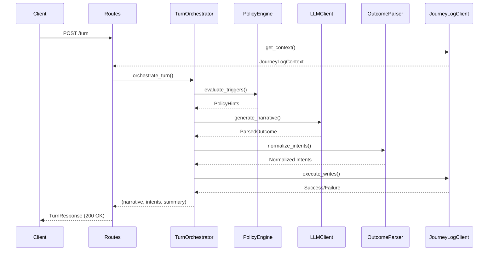
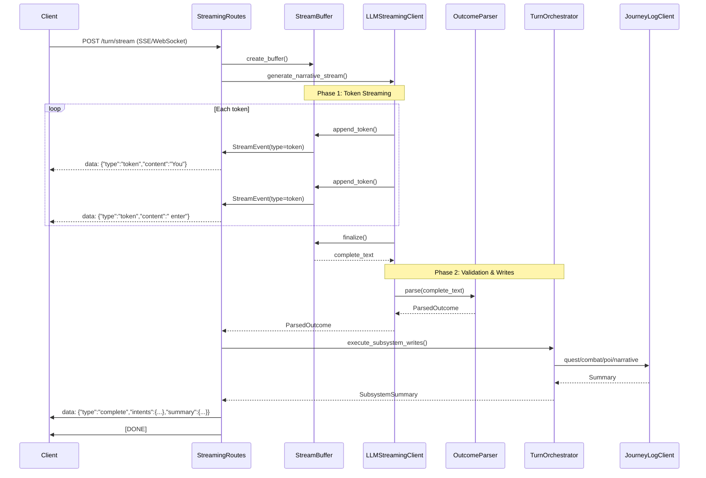

# Narrative Streaming Architecture

## Implementation Status

**Phase 1 Complete (January 2026)**: ✅ Two-phase streaming LLM client implemented

The LLM client layer now supports streaming narrative generation with the following features:

- **`generate_narrative_stream()` method**: New async method in `LLMClient` that streams tokens progressively
- **StreamingCallback protocol**: Type-safe callback interface for consuming tokens
- **Internal buffering**: All tokens buffered internally while streaming to callbacks
- **Two-phase processing**:
  - Phase 1: Stream tokens via OpenAI Responses API (`stream=True`)
  - Phase 2: Parse complete buffer against DungeonMasterOutcome schema
- **Comprehensive logging**: Stream start, progress (every 50 tokens), completion, errors, parse duration
- **Error handling**: Callback exceptions logged but don't interrupt streaming; fallback narratives on parse failures
- **Backward compatibility**: Existing `generate_narrative()` method unchanged
- **Test coverage**: 12 new tests covering all streaming scenarios and edge cases

**Next Steps**: 
- Route layer integration (POST /turn/stream endpoint with SSE transport)
- Turn orchestrator integration for subsystem writes after streaming
- Client libraries and documentation

See implementation in `app/services/llm_client.py` and tests in `tests/test_llm_client.py`.

---

## Executive Summary

This document defines the architecture for streaming narrative text to clients while preserving the existing `DungeonMasterOutcome` contract and maintaining strict subsystem mutation ordering. The streaming layer is designed to be **additive** and **non-breaking**, allowing legacy clients to continue using the synchronous `/turn` endpoint while streaming-capable clients can opt into progressive narrative delivery.

**Key Design Principles:**
1. **Two-Phase Streaming**: Separate token streaming (Phase 1) from outcome validation (Phase 2)
2. **Schema Preservation**: `DungeonMasterOutcome` remains the authoritative contract for structured output
3. **Deterministic Ordering**: Subsystem writes (quest → combat → POI → narrative) occur only after complete validation
4. **Transport Abstraction**: SSE/WebSocket swappable behind a unified interface
5. **Graceful Degradation**: Non-streaming clients receive full responses; streaming clients can disconnect mid-stream

---

## Current Architecture Overview

### Existing Turn Flow (Synchronous)



**Key Characteristics:**
- **Synchronous**: Client blocks until entire turn completes (~1-3 seconds typical)
- **Atomic**: Full narrative text generated before any response sent
- **Validated**: `DungeonMasterOutcome` schema enforced before subsystem writes
- **Deterministic**: Quest → Combat → POI → Narrative write order guaranteed

**Integration Points:**
- `app/services/llm_client.py`: `LLMClient.generate_narrative()` - calls OpenAI Responses API
- `app/services/turn_orchestrator.py`: `TurnOrchestrator.orchestrate_turn()` - enforces sequencing
- `app/api/routes.py`: `POST /turn` - entry point and response assembly

---

## Proposed Streaming Architecture

### Design Goals

1. **Progressive Narrative Delivery**: Stream narrative tokens to client as they're generated
2. **Maintain Schema Contract**: Still validate complete `DungeonMasterOutcome` after streaming
3. **Preserve Write Ordering**: Subsystem writes occur only after full validation
4. **Support Multiple Transports**: SSE and WebSocket behind unified abstraction
5. **Legacy Compatibility**: Non-streaming `/turn` endpoint continues unchanged

### Two-Phase Streaming Model



**Phase 1: Token Streaming (0-2 seconds)**
- LLM tokens streamed to client in real-time
- Tokens buffered internally for replay to journey-log
- Client sees progressive narrative (immediate feedback)
- **No schema validation** during streaming
- **No subsystem writes** during streaming

**Phase 2: Validation & Writes (100-300ms)**
- Complete narrative text assembled from buffered tokens
- `DungeonMasterOutcome` schema validation performed
- Intents normalized (quest/combat/POI fallbacks)
- Subsystem writes executed in deterministic order (quest → combat → POI → narrative)
- Final confirmation sent with intents and summary

---

## Streaming Transport Abstraction

### StreamTransport Interface

The streaming transport abstraction decouples event emission from the underlying transport mechanism (SSE, WebSocket, etc.).

```python
# app/streaming/transport.py

from abc import ABC, abstractmethod
from typing import Dict, Any, Optional
from enum import Enum

class TransportType(Enum):
    """Supported streaming transports."""
    SSE = "sse"              # Server-Sent Events (HTTP)
    WEBSOCKET = "websocket"  # WebSocket (bidirectional)

class StreamEvent:
    """
    Represents a streaming event sent to the client.
    
    Attributes:
        type: Event type (token, metadata, complete, error)
        data: Event payload (token text, metadata, final outcome)
        timestamp: Event timestamp (ISO 8601)
    """
    type: str
    data: Dict[str, Any]
    timestamp: str

class StreamTransport(ABC):
    """
    Abstract base class for streaming transports.
    
    This interface allows swapping between SSE, WebSocket, or other
    transports without changing orchestrator logic.
    
    Implementations must handle:
    - Event serialization (JSON encoding)
    - Transport-specific framing (SSE format, WebSocket messages)
    - Connection lifecycle (open, close, error)
    - Backpressure and buffering
    """
    
    @abstractmethod
    async def send_event(self, event: StreamEvent) -> None:
        """
        Send a streaming event to the client.
        
        Args:
            event: StreamEvent to send
            
        Raises:
            TransportError: If send fails (client disconnect, etc.)
        """
        pass
    
    @abstractmethod
    async def close(self) -> None:
        """
        Close the transport connection gracefully.
        
        Flushes any pending events and releases resources.
        """
        pass
    
    @abstractmethod
    def is_connected(self) -> bool:
        """
        Check if the transport is still connected.
        
        Returns:
            True if client is connected, False otherwise
        """
        pass

class SSETransport(StreamTransport):
    """
    Server-Sent Events transport implementation.
    
    SSE Format:
        data: {"type":"token","content":"Hello"}\n\n
        data: {"type":"complete","intents":{...}}\n\n
    
    Features:
    - HTTP-based (works through firewalls/proxies)
    - Server → client only (no client → server messages)
    - Automatic reconnection support
    - Simple JSON-over-HTTP protocol
    """
    
    def __init__(self, response_stream: Any):
        """
        Initialize SSE transport.
        
        Args:
            response_stream: FastAPI StreamingResponse or similar
        """
        self.response_stream = response_stream
        self._connected = True
    
    async def send_event(self, event: StreamEvent) -> None:
        """Send event in SSE format: data: {json}\n\n"""
        if not self._connected:
            raise TransportError("Transport not connected")
        
        import json
        data = json.dumps({"type": event.type, **event.data})
        try:
            await self.response_stream.write(f"data: {data}\n\n")
        except Exception as e:
            # Client disconnected or write failed
            self._connected = False
            raise TransportError(f"Failed to send SSE event: {e}") from e
    
    async def close(self) -> None:
        """Send SSE [DONE] marker and close stream."""
        if self._connected:
            await self.response_stream.write("data: [DONE]\n\n")
            self._connected = False
    
    def is_connected(self) -> bool:
        return self._connected

class WebSocketTransport(StreamTransport):
    """
    WebSocket transport implementation.
    
    WebSocket Format:
        {"type":"token","content":"Hello"}
        {"type":"complete","intents":{...}}
    
    Features:
    - Bidirectional (client can cancel mid-stream)
    - Lower latency than SSE
    - More complex connection management
    """
    
    def __init__(self, websocket: Any):
        """
        Initialize WebSocket transport.
        
        Args:
            websocket: FastAPI WebSocket connection
        """
        self.websocket = websocket
        self._connected = True
    
    async def send_event(self, event: StreamEvent) -> None:
        """Send event as JSON message."""
        if not self._connected:
            raise TransportError("Transport not connected")
        
        import json
        try:
            await self.websocket.send_json({"type": event.type, **event.data})
        except Exception as e:
            # Connection closed or send failed
            self._connected = False
            raise TransportError(f"Failed to send WebSocket event: {e}") from e
    
    async def close(self) -> None:
        """Close WebSocket connection."""
        if self._connected:
            await self.websocket.close()
            self._connected = False
    
    def is_connected(self) -> bool:
        return self._connected

class TransportError(Exception):
    """Raised when transport operations fail."""
    pass
```

**Design Notes:**
- **Transport-agnostic events**: `StreamEvent` carries structured data
- **Serialization encapsulation**: Each transport handles its own format
- **Connection state tracking**: `is_connected()` for error handling
- **Async-first**: All operations are async for FastAPI compatibility

---

## Two-Phase LLM Streaming Interface

### StreamingLLMClient

The streaming LLM client extends the existing `LLMClient` to support token streaming while maintaining backward compatibility.

```python
# app/services/streaming_llm_client.py

from typing import AsyncIterator, Optional
from dataclasses import dataclass

@dataclass
class StreamingResult:
    """
    Result of streaming LLM generation.
    
    Attributes:
        buffered_narrative: Complete narrative text (all tokens joined)
        parsed_outcome: Validated DungeonMasterOutcome (or None if invalid)
        token_count: Number of tokens streamed
        duration_ms: Total streaming duration
    """
    buffered_narrative: str
    parsed_outcome: Optional[DungeonMasterOutcome]
    token_count: int
    duration_ms: float

class StreamingLLMClient(LLMClient):
    """
    LLM client with streaming support.
    
    Extends LLMClient to support token streaming while maintaining
    the existing synchronous `generate_narrative()` interface for
    backward compatibility.
    
    Two-phase generation:
    1. Stream tokens to client (via async generator)
    2. Validate complete outcome (same as synchronous flow)
    
    Example:
        client = StreamingLLMClient(api_key="...", model="gpt-5.1")
        
        # Streaming usage
        async for token in client.generate_narrative_stream(instructions, prompt):
            await transport.send_event(StreamEvent("token", {"content": token}))
        
        result = await client.finalize_stream()
        # result.parsed_outcome is validated DungeonMasterOutcome
    """
    
    async def generate_narrative_stream(
        self,
        system_instructions: str,
        user_prompt: str,
        trace_id: Optional[str] = None
    ) -> AsyncIterator[str]:
        """
        Generate narrative with token streaming.
        
        Yields tokens as they're generated by the LLM.
        Tokens are buffered internally for subsequent validation.
        
        Args:
            system_instructions: System prompt (includes schema)
            user_prompt: User action and context
            trace_id: Optional trace ID
            
        Yields:
            str: Individual tokens from LLM
            
        Note:
            Tokens are NOT validated during streaming. Full validation
            occurs in finalize_stream() after all tokens received.
        """
        # Implementation example (pseudocode):
        # 
        # self._buffer = NarrativeBuffer()
        # 
        # # Use OpenAI streaming (if Responses API supports it)
        # response = await self.client.responses.create(
        #     model=self.model,
        #     instructions=system_instructions,
        #     input=user_prompt,
        #     stream=True,  # Enable streaming
        #     text={"format": {"type": "json_schema", "schema": schema}}
        # )
        # 
        # async for chunk in response:
        #     if chunk.output and chunk.output[0].content:
        #         token = chunk.output[0].content
        #         self._buffer.append(token)
        #         yield token
        # 
        # # If Responses API doesn't support streaming, use Chat Completions:
        # # response = await self.client.chat.completions.create(
        # #     model="gpt-4",
        # #     messages=[{"role": "system", "content": system_instructions},
        # #               {"role": "user", "content": user_prompt}],
        # #     stream=True
        # # )
        # # async for chunk in response:
        # #     if chunk.choices[0].delta.content:
        # #         token = chunk.choices[0].delta.content
        # #         self._buffer.append(token)
        # #         yield token
        pass
    
    async def finalize_stream(self) -> StreamingResult:
        """
        Finalize streaming and validate complete outcome.
        
        This method:
        1. Assembles complete narrative from buffered tokens
        2. Validates against DungeonMasterOutcome schema
        3. Normalizes intents (quest/POI fallbacks)
        4. Returns validated outcome
        
        Returns:
            StreamingResult with buffered narrative and parsed outcome
            
        Raises:
            LLMResponseError: If validation fails critically
            
        Note:
            Validation errors are non-fatal. If schema validation fails,
            narrative is still preserved but parsed_outcome is None.
        """
        # Implementation example (pseudocode):
        # 
        # # Get complete narrative from buffer
        # complete_narrative = self._buffer.get_complete_narrative()
        # 
        # # If using hybrid approach (Chat for streaming, Responses for validation):
        # # Make a second API call to Responses API for validation
        # # validation_response = await self.client.responses.create(
        # #     model="gpt-5.1",
        # #     instructions="Extract structured intents from narrative",
        # #     input=complete_narrative,
        # #     text={"format": {"type": "json_schema", "schema": schema}}
        # # )
        # # outcome = self.parser.parse(validation_response.output[0].content)
        # 
        # # If Responses API supports streaming, parse buffered JSON directly:
        # # outcome = self.parser.parse(complete_narrative)
        # 
        # return StreamingResult(
        #     buffered_narrative=complete_narrative,
        #     parsed_outcome=outcome.outcome if outcome.is_valid else None,
        #     token_count=self._buffer.get_token_count(),
        #     duration_ms=self._buffer.get_duration_ms()
        # )
        pass
```

**Design Notes:**
- **Async iterator pattern**: `generate_narrative_stream()` yields tokens
- **Internal buffering**: Tokens buffered for replay to journey-log
- **Validation deferred**: Schema checking happens in `finalize_stream()`
- **Backward compatible**: Existing `generate_narrative()` remains unchanged

---

## Streaming Event Contracts

### Event Types

All streaming events follow a consistent JSON structure:

```json
{
  "type": "token" | "metadata" | "preview" | "complete" | "error",
  "timestamp": "2025-01-17T04:30:00.000Z",
  "data": { ... }
}
```

### 1. Token Event

Carries a single narrative token (word or partial word).

```json
{
  "type": "token",
  "timestamp": "2025-01-17T04:30:00.123Z",
  "data": {
    "content": "You ",
    "index": 0
  }
}
```

**Fields:**
- `content` (string, required): Token text
- `index` (integer, optional): Token sequence number

**Frequency:** 1-5 events per second during LLM generation

### 2. Metadata Event

Provides optional progress metadata during streaming.

```json
{
  "type": "metadata",
  "timestamp": "2025-01-17T04:30:00.456Z",
  "data": {
    "tokens_streamed": 25,
    "estimated_total": 150,
    "progress_pct": 16.7
  }
}
```

**Fields:**
- `tokens_streamed` (integer): Tokens sent so far
- `estimated_total` (integer, optional): Estimated total tokens
- `progress_pct` (float, optional): Progress percentage (0-100)

**Frequency:** Optional, every 10-20 tokens (if supported by LLM)

### 3. Preview Event

Provides early preview of structured intents (before validation).

```json
{
  "type": "preview",
  "timestamp": "2025-01-17T04:30:01.234Z",
  "data": {
    "intents": {
      "quest_intent": {"action": "offer"},
      "combat_intent": {"action": "none"},
      "poi_intent": {"action": "create"}
    },
    "validated": false
  }
}
```

**Fields:**
- `intents` (object, optional): Partial/unvalidated intents
- `validated` (boolean): Always false for preview

**Frequency:** Optional, sent once near end of streaming (not in MVP)

### 4. Complete Event

Signals streaming complete with final validated outcome.

```json
{
  "type": "complete",
  "timestamp": "2025-01-17T04:30:01.789Z",
  "data": {
    "intents": {
      "quest_intent": {
        "action": "offer",
        "quest_title": "Find the Lost Artifact",
        "quest_summary": "An ancient relic has gone missing",
        "quest_details": {...}
      },
      "combat_intent": {"action": "none"},
      "poi_intent": {
        "action": "create",
        "name": "The Old Library",
        "description": "A dusty library filled with ancient tomes"
      },
      "meta": {"player_mood": "curious", "pacing_hint": "normal"}
    },
    "subsystem_summary": {
      "quest_change": {"action": "offered", "success": true, "error": null},
      "combat_change": {"action": "none", "success": null, "error": null},
      "poi_created": {"action": "created", "success": true, "error": null},
      "narrative_persisted": true,
      "narrative_error": null
    },
    "validation": {
      "schema_valid": true,
      "intents_normalized": true
    }
  }
}
```

**Fields:**
- `intents` (object, optional): Validated and normalized intents
- `subsystem_summary` (object): Subsystem write results
- `validation` (object): Schema validation status

**Frequency:** Sent once at end of turn

### 5. Error Event

Signals an error during streaming or validation.

```json
{
  "type": "error",
  "timestamp": "2025-01-17T04:30:01.999Z",
  "data": {
    "error_type": "llm_timeout" | "validation_error" | "transport_error",
    "message": "LLM request timed out after 60s",
    "recoverable": false,
    "partial_narrative": "You enter the tavern..."
  }
}
```

**Fields:**
- `error_type` (string): Machine-readable error classification
- `message` (string): Human-readable error description
- `recoverable` (boolean): Whether client should retry
- `partial_narrative` (string, optional): Narrative streamed before error

**Frequency:** Sent once on error (replaces complete event)

---

## Buffering and Replay Mechanism

### Narrative Buffer

The narrative buffer accumulates streamed tokens and provides replay for journey-log persistence.

```python
# app/streaming/buffer.py

from typing import List, Optional
import time
from datetime import datetime, timezone

class NarrativeBuffer:
    """
    Buffers streamed narrative tokens for replay.
    
    This buffer serves two purposes:
    1. Accumulate tokens during streaming for client delivery
    2. Provide complete narrative for journey-log POST
    
    The buffer guarantees that the narrative persisted to journey-log
    is EXACTLY the same text streamed to the client, token-for-token.
    
    Example:
        buffer = NarrativeBuffer()
        
        # During streaming
        async for token in llm_client.generate_narrative_stream(...):
            buffer.append(token)
            await transport.send_event(StreamEvent("token", {"content": token}))
        
        # After streaming
        complete_narrative = buffer.get_complete_narrative()
        await journey_log_client.persist_narrative(character_id, complete_narrative)
    """
    
    def __init__(self):
        self._tokens: List[str] = []
        self._finalized: bool = False
        # Use monotonic clock for duration (not affected by system clock changes)
        self._start_time_monotonic: float = time.monotonic()
        self._duration_ms: Optional[float] = None
        # Use UTC timestamp for logging
        self._start_time_utc: datetime = datetime.now(timezone.utc)
    
    def append(self, token: str) -> None:
        """
        Append a token to the buffer.
        
        Args:
            token: Token text from LLM
            
        Raises:
            BufferError: If buffer is already finalized
        """
        if self._finalized:
            raise BufferError("Cannot append to finalized buffer")
        
        self._tokens.append(token)
    
    def get_complete_narrative(self) -> str:
        """
        Get the complete narrative text.
        
        Joins all buffered tokens into a single string.
        This is the EXACT text that was streamed to the client.
        
        Returns:
            Complete narrative text
        """
        return "".join(self._tokens)
    
    def finalize(self) -> None:
        """
        Mark buffer as finalized (no more tokens).
        
        Records end time for duration calculation using monotonic clock.
        """
        if not self._finalized:
            self._duration_ms = (time.monotonic() - self._start_time_monotonic) * 1000
            self._finalized = True
    
    def get_token_count(self) -> int:
        """Get number of tokens buffered."""
        return len(self._tokens)
    
    def get_duration_ms(self) -> Optional[float]:
        """
        Get streaming duration in milliseconds.
        
        Returns:
            Duration in ms, or None if not finalized
        """
        return self._duration_ms

class BufferError(Exception):
    """Raised when buffer operations fail."""
    pass
```

**Design Notes:**
- **Token-by-token accumulation**: Preserves exact LLM output
- **Finalization marker**: Prevents modification after completion
- **Duration tracking**: For metrics and logging
- **Simple replay**: `get_complete_narrative()` joins tokens

---

## Sequencing and Failure Handling

### Event Sequencing Guarantees

The streaming architecture provides the following ordering guarantees:

1. **Token Order**: Tokens are delivered in the order generated by the LLM
2. **Event Order**: Events are sent in this sequence:
   - 0+ `token` events (one per token)
   - 0+ `metadata` events (interleaved with tokens)
   - 0-1 `preview` event (optional, near end)
   - 1 `complete` event **OR** 1 `error` event
3. **Subsystem Write Order**: Writes occur ONLY after `complete` event sent:
   - Quest write (PUT/DELETE)
   - Combat write (PUT)
   - POI write (POST)
   - Narrative write (POST)

**Critical Constraint**: Subsystem writes NEVER occur during token streaming. They are deferred until Phase 2 validation completes.

### Failure Scenarios

#### 1. LLM Timeout During Streaming

**Scenario**: LLM stream stops mid-narrative (timeout, rate limit, etc.)

**Handling**:
1. Stop sending `token` events
2. Finalize buffer with partial narrative
3. Send `error` event with `error_type: "llm_timeout"`
4. Include `partial_narrative` in error data
5. **No subsystem writes** (turn fails)

**Client Impact**: Receives partial narrative and error event

**Example**:
```json
{
  "type": "error",
  "data": {
    "error_type": "llm_timeout",
    "message": "LLM request timed out after 60s",
    "recoverable": true,
    "partial_narrative": "You enter the tavern and see..."
  }
}
```

#### 2. Schema Validation Failure After Streaming

**Scenario**: Complete narrative received but fails `DungeonMasterOutcome` validation

**Handling**:
1. All `token` events sent successfully (narrative complete)
2. `OutcomeParser` extracts narrative but validation fails
3. Intents set to None (no structured data)
4. Narrative still persisted to journey-log (fallback behavior)
5. Send `complete` event with `validation.schema_valid: false`
6. **No subsystem writes** (no valid intents to process)

**Client Impact**: Receives full narrative but no intents

**Example**:
```json
{
  "type": "complete",
  "data": {
    "intents": null,
    "subsystem_summary": {
      "quest_change": {"action": "none"},
      "combat_change": {"action": "none"},
      "poi_created": {"action": "none"},
      "narrative_persisted": true
    },
    "validation": {
      "schema_valid": false,
      "error_details": "intents.quest_intent.action: literal_error"
    }
  }
}
```

#### 3. Client Disconnect Mid-Stream

**Scenario**: Client closes connection during token streaming

**Handling**:
1. `transport.is_connected()` returns false
2. Stop sending `token` events
3. Finalize buffer with partial narrative
4. **Continue with Phase 2 validation** (turn completes server-side)
5. Narrative persisted to journey-log (even if client disconnected)
6. Subsystem writes executed if validation succeeds
7. Log disconnect event for observability

**Client Impact**: Connection closed, no more events received

**Rationale**: Server-side turn completion ensures game state consistency even if client disconnects.

#### 4. Subsystem Write Failure After Streaming

**Scenario**: Narrative streamed successfully but quest/combat/POI write fails

**Handling**:
1. All `token` events sent successfully
2. Validation succeeds, intents parsed
3. Subsystem write fails (e.g., quest PUT returns 409 Conflict)
4. Narrative still persisted (always attempted)
5. Send `complete` event with `subsystem_summary` showing failure
6. Client receives full narrative + failure details in summary

**Client Impact**: Receives complete narrative but subsystem write error in summary

**Example**:
```json
{
  "type": "complete",
  "data": {
    "intents": {...},
    "subsystem_summary": {
      "quest_change": {
        "action": "offered",
        "success": false,
        "error": "Active quest already exists (HTTP 409 Conflict)"
      },
      "narrative_persisted": true
    }
  }
}
```

---

## Integration with Existing System

### Modified Components

#### 1. app/api/routes.py

**New Endpoint**: `POST /turn/stream`

```python
@router.post("/turn/stream")
async def process_turn_stream(
    request: TurnRequest,
    transport_type: TransportType = TransportType.SSE
):
    """
    Process a turn with streaming narrative delivery.
    
    This endpoint extends the existing /turn flow with streaming:
    1. Fetch context (same as /turn)
    2. Policy decisions (same as /turn)
    3. LLM generation WITH STREAMING (new)
    4. Validation and writes (same as /turn, deferred after streaming)
    
    Args:
        request: TurnRequest (same as /turn)
        transport_type: Streaming transport (SSE or WebSocket)
        
    Returns:
        StreamingResponse (SSE) or WebSocket connection
    """
    # Implementation example (pseudocode):
    # 
    # # Step 1: Fetch context (same as /turn)
    # context = await journey_log_client.get_context(request.character_id)
    # 
    # # Step 2: Policy decisions (same as /turn)
    # policy_hints = policy_engine.evaluate_triggers(context)
    # 
    # # Step 3: Create streaming components
    # buffer = NarrativeBuffer()
    # 
    # if transport_type == TransportType.SSE:
    #     async def event_stream():
    #         transport = SSETransport(response_stream)
    #         try:
    #             # Step 4: Stream tokens from LLM
    #             async for token in llm_client.generate_narrative_stream(...):
    #                 buffer.append(token)
    #                 await transport.send_event(StreamEvent("token", {"content": token}))
    #             
    #             # Step 5: Finalize and validate
    #             result = await llm_client.finalize_stream()
    #             
    #             # Step 6: Execute subsystem writes (Phase 2)
    #             summary = await turn_orchestrator.execute_subsystem_writes(
    #                 character_id=request.character_id,
    #                 narrative=result.buffered_narrative,
    #                 intents=result.parsed_outcome.intents if result.parsed_outcome else None
    #             )
    #             
    #             # Step 7: Send complete event
    #             await transport.send_event(StreamEvent("complete", {
    #                 "intents": result.parsed_outcome.intents if result.parsed_outcome else None,
    #                 "subsystem_summary": summary
    #             }))
    #         except TransportError as e:
    #             # Client disconnected - complete turn server-side
    #             logger.info("Client disconnected, completing turn server-side")
    #             # Continue with Phase 2 validation and writes...
    #         finally:
    #             await transport.close()
    #     
    #     return StreamingResponse(event_stream(), media_type="text/event-stream")
    pass
```

**Design Notes:**
- **Separate endpoint**: `/turn/stream` vs `/turn` for opt-in streaming
- **Transport negotiation**: SSE default, WebSocket optional
- **Same request model**: `TurnRequest` unchanged
- **Backward compatible**: `/turn` continues unchanged

#### 2. app/services/llm_client.py

**Code Comments**:

```python
class LLMClient:
    """Client for interacting with OpenAI's Responses API.
    
    This client:
    - Uses the OpenAI Responses API (gpt-5.1)
    - Enforces JSON-only output with DungeonMasterOutcome schema
    - Uses response_format with strict JSON schema validation
    - Returns structured DungeonMasterOutcome objects
    - Handles errors and provides fallback mechanisms
    - Supports stub/mock mode for offline development
    
    STREAMING INTEGRATION NOTES:
    --------------------------
    This synchronous client will be extended by StreamingLLMClient to support
    token streaming while maintaining the existing generate_narrative() interface.
    
    Key extension points:
    1. generate_narrative_stream(): New async generator yielding tokens
    2. Internal buffer: Accumulate tokens for replay to journey-log
    3. Validation deferred: Schema checking happens after all tokens received
    
    The DungeonMasterOutcome schema remains authoritative and is enforced in
    Phase 2 (after streaming completes), ensuring no runtime behavior changes.
    
    When implementing streaming:
    - Use OpenAI's streaming API (stream=True parameter)
    - Buffer tokens internally for later validation
    - Preserve existing generate_narrative() for backward compatibility
    - Validate complete outcome only after streaming finishes
    
    See STREAMING_ARCHITECTURE.md for detailed design.
    """
```

#### 3. app/services/turn_orchestrator.py

**Code Comments**:

```python
class TurnOrchestrator:
    """Orchestrator for deterministic turn processing.
    
    The TurnOrchestrator enforces a strict sequence of operations for each
    turn, ensuring deterministic behavior and consistent logging of all
    subsystem changes.
    
    Key Responsibilities:
    - Enforce policy → LLM → parse → derive → execute sequence
    - Gate subsystem actions based on policy decisions and context state
    - Execute writes in deterministic order (quest → combat → POI → narrative)
    - Log all operations for analytics
    - Handle failures gracefully (continue narrative, no retry for DELETE)
    - Support dry-run mode for simulations
    
    STREAMING INTEGRATION NOTES:
    --------------------------
    The orchestrator's deterministic sequencing is preserved in streaming mode:
    
    PHASE 1 (Streaming):
    - Policy decisions (same)
    - LLM token streaming (new)
    - Tokens buffered for replay (new)
    
    PHASE 2 (Validation & Writes):
    - Parse complete narrative from buffer (same parsing logic)
    - Normalize intents (same)
    - Derive subsystem actions (same)
    - Execute writes in order (same)
    
    Key invariants maintained:
    1. Subsystem writes NEVER occur during streaming (Phase 1)
    2. Write order (quest → combat → POI → narrative) preserved (Phase 2)
    3. DungeonMasterOutcome schema is authoritative (validated in Phase 2)
    
    When implementing streaming:
    - orchestrate_turn() logic unchanged for /turn endpoint
    - New orchestrate_turn_stream() for /turn/stream endpoint
    - Same subsystem write logic used in both modes
    - Same failure handling and summary generation
    
    See STREAMING_ARCHITECTURE.md for detailed design.
    """
```

### Non-Modified Components (Preserve Existing Behavior)

The following components remain **completely unchanged**:

1. **app/models.py**: `DungeonMasterOutcome` schema unchanged
2. **app/services/outcome_parser.py**: Parsing and validation logic unchanged
3. **app/services/journey_log_client.py**: Subsystem write operations unchanged
4. **app/services/policy_engine.py**: Policy decisions unchanged
5. **app/prompting/prompt_builder.py**: Prompt construction unchanged

**Rationale**: Streaming is an **additive layer** on top of existing validation and write logic. The core turn processing semantics remain identical.

---

## Usage Patterns

### For Streaming Clients (SSE)

```javascript
// Client-side JavaScript (SSE)
const eventSource = new EventSource('/turn/stream', {
  method: 'POST',
  body: JSON.stringify({
    character_id: 'uuid',
    user_action: 'I search the room'
  })
});

let narrativeText = '';

eventSource.addEventListener('message', (event) => {
  const data = JSON.parse(event.data);
  
  switch (data.type) {
    case 'token':
      // Append token to UI in real-time
      narrativeText += data.content;
      updateNarrativeDisplay(narrativeText);
      break;
    
    case 'metadata':
      // Update progress bar
      updateProgress(data.progress_pct);
      break;
    
    case 'complete':
      // Show final intents and subsystem changes
      displayIntents(data.intents);
      displaySummary(data.subsystem_summary);
      eventSource.close();
      break;
    
    case 'error':
      // Handle error
      displayError(data.message, data.partial_narrative);
      eventSource.close();
      break;
  }
});
```

### For Legacy Clients (Synchronous)

```javascript
// Client-side JavaScript (Legacy)
const response = await fetch('/turn', {
  method: 'POST',
  body: JSON.stringify({
    character_id: 'uuid',
    user_action: 'I search the room'
  })
});

const data = await response.json();

// Full narrative received at once
displayNarrative(data.narrative);
displayIntents(data.intents);
displaySummary(data.subsystem_summary);
```

**Key Difference**: Legacy clients block until full response; streaming clients see progressive narrative.

---

## Performance Considerations

### Latency Comparison

| Phase | Legacy `/turn` | Streaming `/turn/stream` |
|-------|----------------|--------------------------|
| Context Fetch | 100-200ms | 100-200ms (same) |
| Policy Decisions | 1-5ms | 1-5ms (same) |
| LLM Generation | 1000-2000ms | 1000-2000ms (same) |
| **User Sees First Token** | **After 1100-2205ms** | **After ~50-200ms** |
| Validation | 50-100ms | 50-100ms (same) |
| Subsystem Writes | 200-400ms | 200-400ms (same) |
| **Total Latency** | **1350-2705ms** | **1350-2705ms (same)** |

**Key Insight**: Total latency unchanged, but **perceived latency** reduced from ~1.2-2.2s to ~50-200ms (time to first token).

### Resource Usage

**Memory**:
- **Buffer overhead**: ~2-5 KB per streaming turn (buffered tokens)
- **Connection overhead**: ~1-2 KB per SSE connection
- **Peak usage**: Same as legacy (buffer size ≈ narrative size)

**CPU**:
- **Token processing**: Negligible (simple string append)
- **Serialization**: Minimal increase (JSON per token vs JSON once)
- **Validation**: Same as legacy (single validation after streaming)

**Network**:
- **Bandwidth**: ~10-20% increase (JSON framing overhead per token)
- **Latency**: Reduced (progressive delivery)
- **Connections**: One long-lived connection vs one short connection

**Scalability**:
- **Concurrent users**: Limited by open SSE connections (~10K per server)
- **Mitigation**: Use WebSocket for high concurrency, or scale horizontally
- **Load testing**: Test with 100-1000 concurrent streaming turns

---

## Security Considerations

### 1. Client Disconnect Handling

**Risk**: Client disconnects mid-stream, leaving server resources allocated

**Mitigation**:
- Detect disconnect via `transport.is_connected()` check after each event send
- Transport implementations raise `TransportError` on disconnect (see SSETransport/WebSocketTransport error handling)
- Stop streaming immediately on disconnect detection
- Continue server-side validation and writes (ensure game state consistency)
- Clean up buffer and transport resources
- Log disconnect events for observability

**Implementation Note**: Both `SSETransport.send_event()` and `WebSocketTransport.send_event()` now wrap write operations in try-except blocks to detect disconnections and update `_connected` state.

### 2. Streaming Timeout Protection

**Risk**: Slow LLM generation causes indefinite streaming

**Mitigation**:
- Apply same timeout as legacy (`OPENAI_TIMEOUT`, default 60s)
- Send `error` event if timeout reached
- Finalize buffer with partial narrative
- Log timeout events
- Enforce timeout at LLM client level (OpenAI SDK timeout parameter)

### 3. Buffer Memory Limits

**Risk**: Malicious or broken LLM generates unbounded tokens

**Mitigation**:
- Set max buffer size (e.g., 50KB, ~12K tokens)
- Truncate if exceeded, send `error` event
- Log buffer overflow events
- Same max_output_tokens limit as legacy (4000 tokens)
- Monitor buffer sizes in production metrics

**Implementation Guideline**:
```python
class NarrativeBuffer:
    MAX_BUFFER_SIZE = 50_000  # 50KB max
    
    def append(self, token: str) -> None:
        if self._finalized:
            raise BufferError("Cannot append to finalized buffer")
        
        # Check buffer size limit
        current_size = sum(len(t) for t in self._tokens)
        if current_size + len(token) > self.MAX_BUFFER_SIZE:
            self.finalize()
            raise BufferError(f"Buffer size limit exceeded: {current_size} bytes")
        
        self._tokens.append(token)
```

### 4. Duplicate Turn Execution Prevention

**Risk**: Client retries or reconnects could cause same turn to execute multiple times, leading to duplicate subsystem writes

**Mitigation**:
- Use idempotency tokens in `TurnRequest` (add optional `idempotency_key` field)
- Track recent turn executions in Redis/memory cache (TTL: 5 minutes)
- Return cached response if duplicate detected (HTTP 200 with cached result)
- Log duplicate attempts for monitoring
- journey-log service should also enforce idempotency for writes

**Implementation Guideline**:
```python
@router.post("/turn/stream")
async def process_turn_stream(
    request: TurnRequest,
    transport_type: TransportType = TransportType.SSE
):
    # Check idempotency key if provided
    if request.idempotency_key:
        cached = await idempotency_cache.get(request.idempotency_key)
        if cached:
            logger.info("Duplicate turn detected", idempotency_key=request.idempotency_key)
            return cached  # Return cached response
    
    # Process turn...
    result = await orchestrate_turn_stream(...)
    
    # Cache result
    if request.idempotency_key:
        await idempotency_cache.set(request.idempotency_key, result, ttl=300)
    
    return result
```

### 5. Connection Exhaustion Protection

**Risk**: Many concurrent streaming connections exhaust server resources (file descriptors, memory)

**Mitigation**:
- Set max concurrent streaming connections per server (e.g., 1000)
- Return HTTP 503 (Service Unavailable) when limit reached
- Use connection pooling and timeouts
- Monitor active connection count via metrics
- Scale horizontally with load balancer
- Consider WebSocket for higher concurrency (lower overhead than SSE)

**Implementation Guideline**:
```python
# Global semaphore for connection limiting
MAX_STREAMING_CONNECTIONS = 1000
streaming_semaphore = asyncio.Semaphore(MAX_STREAMING_CONNECTIONS)

@router.post("/turn/stream")
async def process_turn_stream(request: TurnRequest):
    # Acquire semaphore (blocks if limit reached)
    if not streaming_semaphore.locked():
        async with streaming_semaphore:
            return await _process_turn_stream_internal(request)
    else:
        # Limit reached, return 503
        raise HTTPException(
            status_code=503,
            detail="Streaming capacity reached. Please retry in a few seconds."
        )
```

### 6. Memory Exhaustion Attack Prevention

**Risk**: Attacker opens many streaming connections and holds them open to exhaust server memory

**Mitigation**:
- Enforce per-IP rate limiting (e.g., max 5 concurrent streams per IP)
- Track connection duration and terminate long-lived idle connections (>120s)
- Monitor memory usage per connection
- Use authentication/authorization to limit abuse
- Deploy behind DDoS protection (e.g., Cloudflare, GCP Cloud Armor)

**Implementation Guideline**:
```python
# Per-IP connection tracking
from collections import defaultdict
ip_connection_count = defaultdict(int)

@router.post("/turn/stream")
async def process_turn_stream(request: Request):
    client_ip = request.client.host
    
    # Check per-IP limit
    if ip_connection_count[client_ip] >= 5:
        raise HTTPException(
            status_code=429,
            detail="Too many concurrent streams from your IP. Please wait."
        )
    
    ip_connection_count[client_ip] += 1
    try:
        return await _process_turn_stream_internal(request)
    finally:
        ip_connection_count[client_ip] -= 1
```

### 7. Transport Type Injection Prevention

**Risk**: Malicious client supplies invalid transport_type parameter to trigger errors or bypass security checks

**Mitigation**:
- Use Pydantic enum validation for `transport_type` parameter
- Only allow whitelisted transport types (`TransportType.SSE`, `TransportType.WEBSOCKET`)
- Validate transport_type before instantiating transport
- Log suspicious transport_type values

**Implementation Guideline**:
```python
from enum import Enum

class TransportType(str, Enum):
    SSE = "sse"
    WEBSOCKET = "websocket"

@router.post("/turn/stream")
async def process_turn_stream(
    request: TurnRequest,
    transport_type: TransportType = TransportType.SSE  # Pydantic validates enum
):
    # transport_type is guaranteed to be valid enum value
    if transport_type == TransportType.SSE:
        transport = SSETransport(...)
    elif transport_type == TransportType.WEBSOCKET:
        transport = WebSocketTransport(...)
    else:
        # Should never reach here due to Pydantic validation
        raise ValueError(f"Invalid transport type: {transport_type}")
```

### 8. Transport Security

**Risk**: SSE/WebSocket vulnerabilities (injection, DoS)

**Mitigation**:
- Validate all events before sending (JSON serialization escapes control chars)
- Use same authentication/authorization as legacy `/turn` endpoint
- Apply rate limiting to `/turn/stream` endpoint (e.g., max 10 requests/minute per user)
- Log suspicious activity (rapid reconnects, etc.)
- Use HTTPS/WSS for encrypted transport
- Set proper CORS headers to prevent cross-origin abuse

---

## Testing Strategy

### Unit Tests

**New Tests** (no existing test modifications):

1. `tests/test_stream_transport.py`:
   - SSETransport event serialization
   - WebSocketTransport message framing
   - Connection state tracking
   - Error handling

2. `tests/test_narrative_buffer.py`:
   - Token appending
   - Buffer finalization
   - Replay functionality
   - Duration tracking

3. `tests/test_streaming_llm_client.py`:
   - Token streaming (mocked OpenAI stream)
   - Buffer integration
   - Validation after streaming
   - Error handling (timeout, disconnect)

### Integration Tests

**New Tests** (no existing test modifications):

1. `tests/test_streaming_turn_integration.py`:
   - Full `/turn/stream` flow (SSE)
   - Token ordering verification
   - Subsystem write deferral (after streaming)
   - Complete event validation
   - Error scenarios (timeout, validation failure, disconnect)

2. `tests/test_streaming_backwards_compat.py`:
   - `/turn` endpoint unchanged
   - Legacy clients not affected
   - Same response format
   - Same error handling

### Manual Testing

**Test Cases**:

1. **Happy Path**: Stream complete narrative, validate, persist
2. **Slow LLM**: Test with `initial_wait` delay in stub mode
3. **Client Disconnect**: Close connection mid-stream, verify server completes turn
4. **Validation Failure**: Force schema error, verify narrative still persisted
5. **Subsystem Write Failure**: Force 409 conflict, verify error in summary

---

## Migration Path

### Phase 1: Design & Documentation (This Issue)

- [x] Document two-phase streaming architecture
- [x] Define transport abstraction interfaces
- [x] Define streaming event contracts
- [x] Document buffering and replay mechanisms
- [x] Document failure handling
- [x] Update README.md with streaming overview
- [x] Add integration comments to key files

### Phase 2: Core Streaming Infrastructure (Future Issue)

- [ ] Implement `StreamTransport` interface
- [ ] Implement `SSETransport` and `WebSocketTransport`
- [ ] Implement `NarrativeBuffer`
- [ ] Implement `StreamingLLMClient`
- [ ] Add unit tests for streaming components
- [ ] Add integration tests for streaming flow

### Phase 3: API Integration (Future Issue)

- [ ] Add `POST /turn/stream` endpoint
- [ ] Integrate with `TurnOrchestrator`
- [ ] Add end-to-end tests
- [ ] Add metrics for streaming (tokens/sec, buffer usage, etc.)
- [ ] Update OpenAPI spec with streaming endpoint

### Phase 4: Production Readiness (Future Issue)

- [ ] Load testing (100-1000 concurrent streams)
- [ ] Monitor memory usage under load
- [ ] Tune buffer sizes and timeouts
- [ ] Add observability (streaming latency, disconnect rate, etc.)
- [ ] Document deployment considerations (Cloud Run streaming limits, etc.)

---

## Open Questions

### 1. OpenAI Responses API Streaming Support

**Question**: Does the OpenAI Responses API support streaming (like Chat Completions)?

**Answer**: **Unknown** - Documentation unclear as of 2025-01-17

**Research Needed**:
- Check OpenAI API docs for Responses API streaming parameter
- Test with `stream=True` parameter

**Fallback Strategy (If Responses API doesn't support streaming)**:

If the OpenAI Responses API does not support streaming, implement a **hybrid approach**:

1. **Phase 1 (Streaming)**: Use Chat Completions API with `stream=True`
   - Stream tokens to client in real-time
   - Buffer tokens internally for validation
   - No JSON schema enforcement during streaming (Chat API limitation)

2. **Phase 2 (Validation)**: Use Responses API for schema validation
   - Assemble complete narrative from buffered tokens
   - Make a second API call to Responses API with complete narrative as input
   - Use strict JSON schema validation to parse DungeonMasterOutcome
   - Extract intents from validated response

**Hybrid Implementation Pseudocode**:
```python
# Phase 1: Stream from Chat Completions API
async for token in openai.chat.completions.create(
    model="gpt-4",  # Or similar model
    messages=[...],
    stream=True
):
    buffer.append(token)
    yield token

# Phase 2: Validate with Responses API
complete_narrative = buffer.get_complete_narrative()
validation_response = await openai.responses.create(
    model="gpt-5.1",
    instructions="Extract structured intents from this narrative",
    input=complete_narrative,
    text={"format": {"type": "json_schema", "schema": schema}}
)
outcome = parse_outcome(validation_response)
```

**Trade-offs**:
- **Pro**: Preserves streaming UX and schema validation
- **Pro**: No changes to DungeonMasterOutcome contract
- **Con**: Additional API call adds 200-500ms latency to Phase 2
- **Con**: Increased cost (2 API calls per turn instead of 1)

**Recommendation**: Research Responses API streaming support before finalizing. If unsupported, proceed with hybrid approach and document cost implications.

### 2. Preview Events Before Validation

**Question**: Should we send `preview` events with unvalidated intents before streaming completes?

**Pros**: Client can show "Loading quest..." UI early
**Cons**: Preview may be wrong if validation fails; adds complexity

**Decision**: **Defer to Phase 3** - Focus on token streaming first

### 3. Multiple Transport Priority

**Question**: Should we support both SSE and WebSocket in initial implementation?

**Recommendation**: **SSE only in MVP** (simpler, sufficient for MVP)
- WebSocket adds complexity (bidirectional, connection management)
- SSE sufficient for server → client streaming
- Can add WebSocket later if needed for bidirectional features

---

## Summary

### Key Architectural Decisions

1. **Two-Phase Streaming**: Separate token delivery (Phase 1) from validation (Phase 2)
2. **Schema Preservation**: `DungeonMasterOutcome` remains authoritative, validated in Phase 2
3. **Additive Design**: Streaming is layered on top, existing `/turn` endpoint unchanged
4. **Transport Abstraction**: `StreamTransport` interface supports SSE/WebSocket swapping
5. **Buffer Replay**: Narrative buffered during streaming, replayed to journey-log verbatim
6. **Graceful Degradation**: Client disconnects don't prevent server-side turn completion

### Benefits

- **Improved UX**: Users see narrative ~1-2 seconds earlier (perceived latency reduction)
- **No Schema Changes**: `DungeonMasterOutcome` contract preserved
- **Backward Compatible**: Legacy clients unaffected
- **Flexible Transports**: SSE/WebSocket swappable
- **Consistent State**: Subsystem writes still deterministic and ordered

### Risks

- **Complexity**: Two execution paths (streaming vs synchronous)
- **OpenAI API Support**: Unclear if Responses API supports streaming
- **Resource Usage**: Long-lived connections increase server load
- **Testing Surface**: More failure modes to test

### Next Steps

See **Migration Path** above for phased implementation plan.

---

## References

- **Existing Code**:
  - `app/services/llm_client.py`: Current LLM integration
  - `app/services/turn_orchestrator.py`: Current turn sequencing
  - `app/api/routes.py`: Current `/turn` endpoint
  - `app/models.py`: `DungeonMasterOutcome` schema

- **External Resources**:
  - [OpenAI Responses API Documentation](https://platform.openai.com/docs/api-reference/responses)
  - [FastAPI Streaming Responses](https://fastapi.tiangolo.com/advanced/custom-response/#streamingresponse)
  - [Server-Sent Events (SSE) Specification](https://html.spec.whatwg.org/multipage/server-sent-events.html)
  - [WebSocket API Documentation](https://developer.mozilla.org/en-US/docs/Web/API/WebSocket)

---

**Document Version**: 1.0  
**Last Updated**: 2025-01-17  
**Author**: Dungeon Master Development Team  
**Status**: Design Phase Complete
